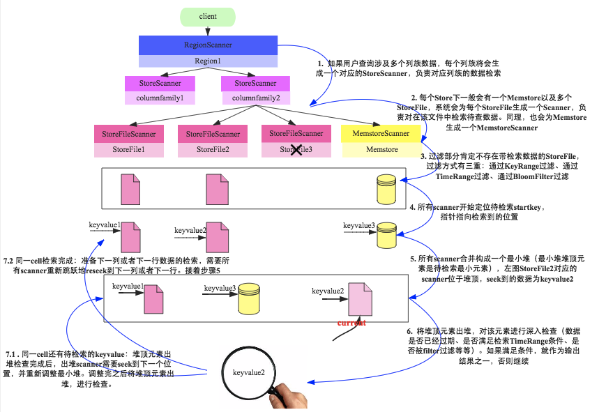

# 常见系统的数据结构应用

## MySQL

### 索引：哈希表

哈希表的查询的时间复杂度为 `O(1)` ，所以使用哈希索引定位记录会非常快。但由于比较的是 Hash 运算之后的 Hash 值，而且是无序的，所以只能用于点查询了，即可以满足“=”、“!=”和“in”的查询，但对于“>”、”<“这样的范围查询，就只能指望 B 树 / B+ 树索引了。

### 索引： B+ 树

MySQL 的索引就是在 B+ 树的基础上稍微改造了一点来实现的，主要改变的是：

1. 父节点中存储的记录是下层子树中的最小值
2. 非叶子节点的子树指针与关键字个数相同（其实这一条也是由于上一条导致的）

另外，对于不同的 MySQL 的存储引擎，对于 B+ 树的索引实现，也有细微的区别：

* MyISAM 引擎中 B+ 树的叶子节点存放的是**记录的地址**
* InnoDB 引擎中，主索引（即主键索引，也就是数据文件）中的叶子节点存储的是**完整的数据记录**，这种索引叫做聚集索引。而其他索引（辅助索引 / 非聚集索引）中的叶子节点存储的是**主键值**，因此走辅助索引的话需要走两步，**先找到主键，再通过主键从主键索引中检索具体记录**。

这里顺便说几点：

1. 因为 InnoDB 的数据文件本身要按主键聚集，所以 **InnoDB 要求表必须有主键**（MyISAM 可以没有），如果没有显式指定，则 MySQL 系统会自动选择一个可以唯一标识数据记录的列作为主键，如果不存在这种列，则 MySQL 自动为 InnoDB 表生成一个隐含字段作为主键，这个字段长度为 6 个字节，类型为长整型。
2. 因为辅助索引都保存引用主键索引，所以**不建议 InnoDB 表主键设置过长**，否则将使辅助索引变得过大。
3. **尽量在 InnoDB 上采用自增字段做主键**，因为这样的话，每次插入新的记录，记录就会顺序添加到当前索引节点的后续位置，当一页写满，就会自动开辟一个新的页。否则每次新纪录可能都要被插到现有索引页的中间某个位置，这会带来数据移动和分页等操作，还会造成大量的碎片。

## Redis

### list: 链表

Redis 中 list 用到的是双向链表，且支持从表头和表尾追加和移除元素，因此也可以当做栈或者队列来使用。

正因为是使用链表实现，所以如果 list 很长时，使用 `linsert` （在指定值前后插入）或者 `lindex` （读取指定位置）命令时， `O(n)` 的时间复杂度可能需要你关注下。

如果要深入了解的话，其实 list 底层用到的是一个叫“quicklist"的数据结构。官方解释为：

> A doubly linked list of ziplists 

一个由 ziplist（压缩列表） 组成的双向链表。这里的压缩列表可以简单理解为一个压缩后的数组，主要特点是数据在内存中连续存储，所以可以将 quicklist 理解为数组的链表，巧妙地将数组和链表的优点结合起来了。不过这也带来一个难题——ziplist 的大小到底为多少比较合适？

1. **ziplist 越短，则内存碎片越多**。内存碎片多了，有可能在内存中产生很多无法被利用的小碎片，从而降低存储效率。这种情况的极端是每个 quicklist 节点上的 ziplist 只包含一个数据项，这就蜕化成一个普通的双向链表了。
2. **ziplist 越长，则为其分配大块连续内存空间的难度就越大**。有可能出现内存里有很多小块的空闲空间（它们加起来很多），但却找不到一块足够大的空闲空间分配给 ziplist 的情况。这同样会降低存储效率。这种情况的极端是整个quicklist只有一个节点，所有的数据项都分配在这仅有的一个节点的ziplist里面。这其实蜕化成一个ziplist了。

PS: 看到了吧，这就是我们要付出的代价。

### hash: 哈希表

既然是哈希表，就离不开两个问题：

1. 哈希冲突

   Redis 中采取的是**链地址法**，将冲突的数据追加在链表的尾部。

2. 扩容

   在 hash 中的元素越来越拥挤（hash 碰撞比较频繁）时，这个时候便需要进行扩容，申请更大的数据，这个时候就需要对之前的元素进行 rehash 。这里问题来了，如果 hash 结构比较大呢？一次 rehash 会耗时很长，因此 Redis 采用了**渐进式 rehash** 的方案。它会同时保留新旧两个 hash ，后续的定时任务以及 hash 结构的读写指令中将旧结构的元素逐渐迁移到新的结构中，从而避免因扩容导致的线程卡顿现象。

此外，当 hash 因为元素的逐渐删除变得越来越稀疏时，Redis 还会对 hash 进行**缩容**来减少 hash 的空间占用。

### sorted set: 跳表

在上一篇文章[数据结构大梳理]()中已经提到了跳表这个数据结构，这里再说一下，个人对于跳表觉得最神奇的地方在于它维持平衡的方式。跳表在插入数据时，会引入一个随机层数 `L`（level），然后将其插入到第一层到第 `L` 中。然而就是这样一个简单的方法却保证了跳表的时间复杂度在 `O(log n)` ，这已经被人从数学上证明了。

通常这里会有个疑问，就是为什么 Redis 不使用平衡二叉查找树（如红黑树），一般来说主要有两个原因：

1. 在插入和删除时，跳表只需要修改相邻节点的指针即可，而平衡二叉查找树可能需要做复杂的左旋、右旋等。
2. 实现简单。

千万不要小瞧了第 2 点，实现简单意味着更简洁的代码、更少的 Bug，也更有优化的空间。关于这一点 Redis 的作者 [antirez](https://news.ycombinator.com/item?id=1171423) 本人就有提过：

> They are simpler to implement, debug, and so forth. For instance thanks to the skip list simplicity I received a patch (already in Redis master) with augmented skip lists implementing ZRANK in O(log(N)). It required little changes to the code.

## HBase

了解了 LSM 树（Log-Structured Merge Tree），就不难记住 HBase 的数据存储和读写流程了。下面分别针对读写与 LSM 树中的概念进行一一对应。

### 写流程

1. **找 RegionServer**：向 Zookeeper 发起请求，从 ROOT 表中获得 META 所在的 Region，再根据 table、namespace、rowkey，去 meta 表中找到目标数据对应的 Region 信息以及 RegionServer
2. **写内存**：**写 MemStore**（即 LSM 树中的 MemTable），**同时写 HLog** （即 LSM 树中的 Log），用于内存数据（MemStore）丢失时恢复。
3. **写磁盘**：当 MemStore 数据达到阈值（默认是 64M），**将数据刷到硬盘中的 StoreFile**（即 LSM 树中的 SSTable），将内存中的数据删除同时删除Hlog中的历史数据。
4. **合并磁盘文件**：当多个 StoreFile 文件达到一定的大小后，会**触发 Compact 合并**（即 LSM 树中的 SSTable 的 Merge）操作，合并为一个 StoreFile，这里同时进行版本的合并和数据删除。
5. **Regin 分裂**：当 Compact 后，逐步形成越来越大的 StoreFIle 后，会触发 Split 操作，把当前的 StoreFile 分成两个，这里相当于把一个大的 region 分割成两个 region。

### 读流程

1. **找 RegionServer**。具体同上。
2. **从 MemStore 中查**。
3. 如果从 MemStore 中查不到的话，就**从 StoreFile 中查**。

如果深入了解细节的话，读流程比这复杂很多，是因为一次范围查询可能会涉及多个分片、多块缓存甚至多个数据存储文件，而更新和删除相对比较简单的原因在于更新操作并没有更新原有数据，而是使用时间戳属性实现了多版本，删除操作也并没有真正删除原有数据，而是打了一个标签。

下图是读取数据的流程细节：

## 参考文章

1. [通俗易懂的Redis数据结构基础教程](https://juejin.im/post/5b53ee7e5188251aaa2d2e16)
2. [quicklist vs ziplist](https://www.jianshu.com/p/ce24c9520731)
3. [Redis内部数据结构详解(5)——quicklist](http://zhangtielei.com/posts/blog-redis-quicklist.html)
4. [HBase原理－数据读取流程解析](http://hbasefly.com/2016/12/21/hbase-getorscan/)
5. [HBase原理－迟到的‘数据读取流程’部分细节](http://hbasefly.com/2017/06/11/hbase-scan-2/)