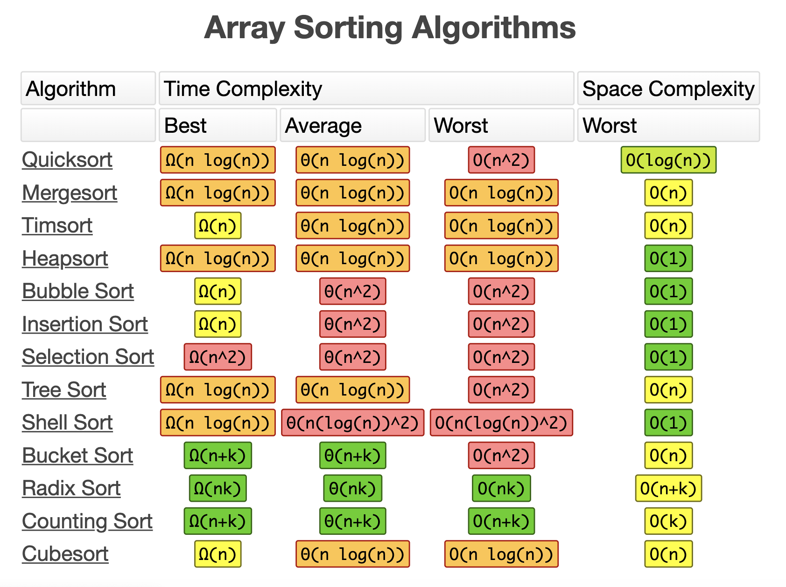

# 排序算法

## 定义

假设含有 n 个记录的序列为 {r1, r2, ..., rn}，其相应的关键字分别为 {k1, k2, .., kn}，需确定 1, 2, ...,n 的一种排列 p1, p2, ..., pn，使其相应的关键字满足 kp1 <= kp2 <= ... <= kpn 非递减（或非递增）关系，即使得序列成为一个按关键字有序的序列 {rp1, rp2, ..., rpn}，这样的操作就称为排序。

### 相关属性

**稳定性**

指的是关键字相等的两个记录，在排序后依然保持排序前的相对顺序。

**性能影响因素**

时间性能、算法实现复杂度

## 冒泡排序

两两比较相邻的关键字，如果反序则交换，直到没有反序的记录为止。

## 简单选择排序

 每次从剩余的元素中选择最小的元素放在前面，这样到最后就是整体有序的。

## 直接插入排序

从第二个元素开始，把前面的元素当成有序的集合，按照大小关系插在其中合适的位置。

## 希尔排序

将所有元素分组，分组的依据是相隔 k 个元素，对于组内的元素进行插入排序。然后依次缩减增量（将 k 减小）继续分组并排序，直到 k=1 则整体有序。

这里需要注意的是 k 减小的方式，最简单的就是 k = k / 2。这个公式称为“**增量序列**”，实际上可以通过数学证明找到较优的增量序列的算法。

## 堆排序

将待排序序列构造成一个大顶堆（倒序则为小顶堆，后面也都相反），此时整个序列的最大值就是堆顶。将其与末尾元素进行交换，此时末尾就为最大值。然后将剩余的 n-1 个元素重新构造成一个大顶堆，这样会得到 n 个元素的次小值。如此反复执行，便能得到一个有序序列了。

## 归并排序

核心思想是分治策略。首先将元素看成是 n 个有序的子序列，每个子序列的长度为 1。然后两两合并，得到 n/2 个有序的子序列，继续将合并后序列中的两两子序列进行合并。如此重复，直至得到一个长度为 n 的有序序列为止。

## 快速排序

核心思想也是分治策略。先将元素分成两个序列，其中一个的元素比另外一个的元素全都要小，这样继续对这两个序列进行类似的排序，最终无法再切分时则整体有序。

## 算法分类

根据排序过程中的主要操作，将它们分为以下几类：

* 交换排序类：冒泡排序、快速排序
* 选择排序类：简单选择排序、堆排序
* 插入排序类：直接插入排序、希尔排序
* 归并排序类：归并排序

## 常见排序算法时间复杂度

