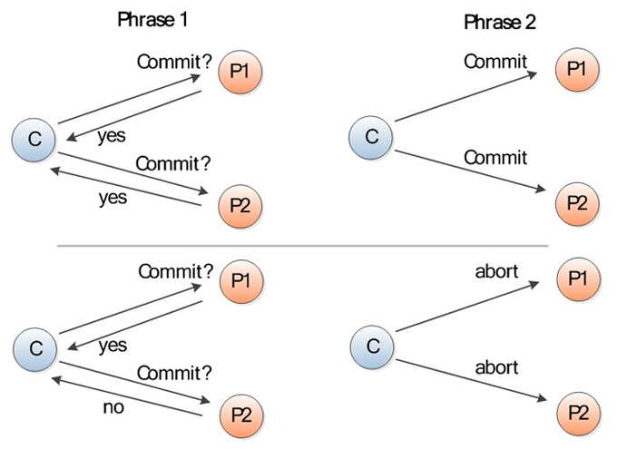

# 两阶段提交协议

## 详细过程

### 第一阶段（提交请求阶段）：

1. 协调者（coordinator）向所有参与者（participants）询问是否可以执行提交操作，并开始等待各参与者节点的响应。
2. 参与者节点执行询问发起为止的所有事务操作，并将 Undo 信息和 Redo 信息写入日志。
3. 各参与者节点响应协调者节点发起的询问。如果参与者节点的事务操作实际执行成功，则它返回一个"同意"消息；如果参与者节点的事务操作实际执行失败，则它返回一个"中止"消息。

### 第二阶段（提交执行阶段）：

#### 成功

当协调者节点从所有参与者节点获得的相应消息都为"同意"时：

协调者节点向所有参与者节点发出"正式提交"的请求。
参与者节点正式完成操作，并释放在整个事务期间内占用的资源。
参与者节点向协调者节点发送"完成"消息。
协调者节点收到所有参与者节点反馈的"完成"消息后，完成事务。

#### 失败

如果任一参与者节点在第一阶段返回的响应消息为"终止"，或者 协调者节点在第一阶段的询问超时之前无法获取所有参与者节点的响应消息时：

协调者节点向所有参与者节点发出"回滚操作"的请求。
参与者节点利用之前写入的 Undo 信息执行回滚，并释放在整个事务期间内占用的资源。
参与者节点向协调者节点发送"回滚完成"消息。
协调者节点收到所有参与者节点反馈的"回滚完成"消息后，取消事务。
有时候，第二阶段也被称作完成阶段，因为无论结果怎样，协调者都必须在此阶段结束当前事务。

## 优点

实现简单

## 缺点

1. 它的执行过程中，节点都处于阻塞状态。
2. 协调者节点指示参与者节点进行提交等操作时，如有参与者节点出现了崩溃等情况而导致协调者始终无法获取所有参与者的响应信息，这时协调者将只能依赖协调者自身的超时机制来生效。但往往超时机制生效时，协调者都会指示参与者进行回滚操作。这样的策略显得比较保守。