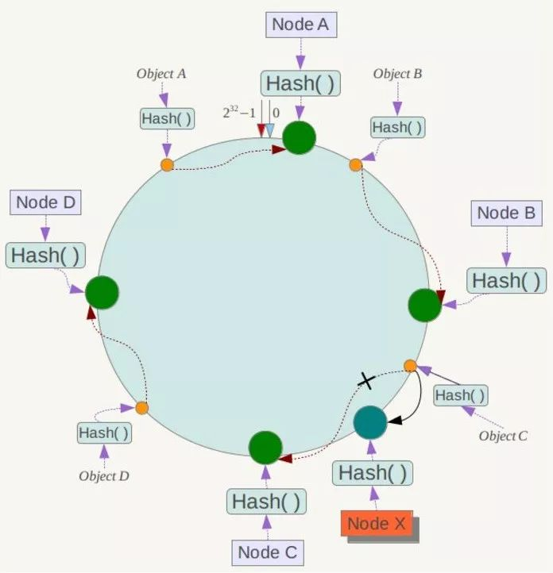

# 一致性 hash

## 背景

为了解决简单的 hash 在增删节点时带来的问题——可能要对所有的数据进行重新分配。

## 基本实现

构建环形 hash 值空间，将节点映射在环上，这样在对数据做 hash 运算时，将结果按照顺时针找到最近的节点即可。

此时，
删除节点时：将属于该节点的数据复制到下一个节点即可，不影响其他数据。
增加节点时：将下一个节点的数据的一部分复制给新节点，不影响其他数据。

## 新问题

由于 hash 算法并不保证平衡，那么如何解决热点问题——大部分数据集中在同一个节点？
**解决**： 引入虚拟节点，这样可以缓解即使节点较少导致的数据倾斜问题，在实际应用中，通常将虚拟节点数设置为32甚至更大。

