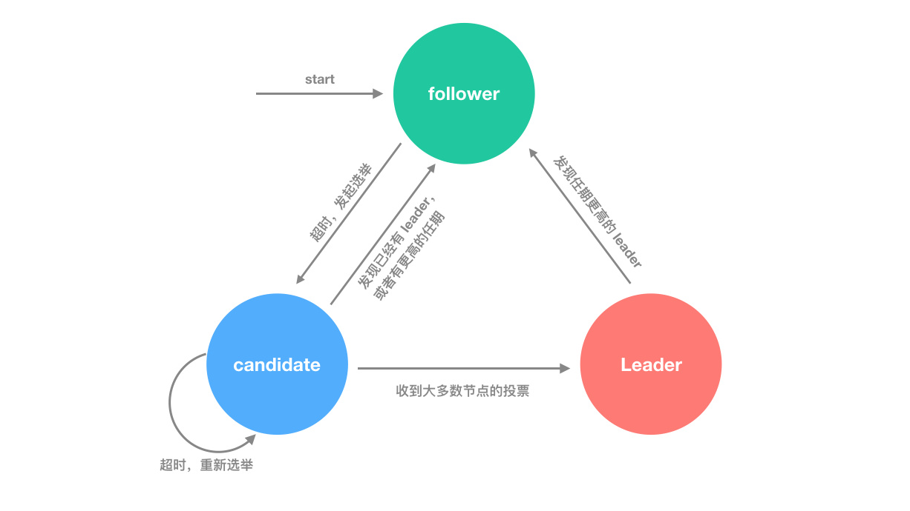
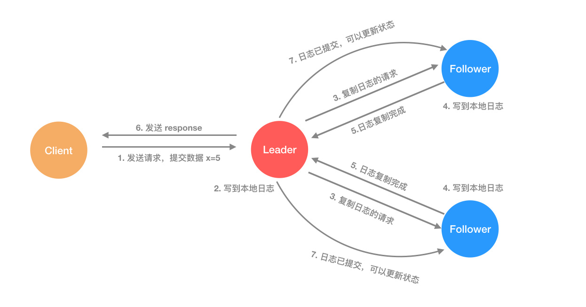

# Raft 算法

## 简介

Raft算法在2014年提出，它的头号目标就是容易理解（UnderStandable），为了达到易于理解的目标，raft做了很多努力，其中最主要是两件事情：
* 问题分解
* 状态简化

Raft 将一致性问题分解成为三个相对独立的子问题：

领导人选取（Leader election）： 在一个领导人宕机之后必须要选取一个新的领导人

日志复制（Log replication）： 领导人必须从客户端接收日志然后复制到集群中的其他服务器，并且强制要求其他服务器的日志保持和自己相同

安全性（Safety）： 如果一个服务器已经将给定索引位置的日志条目应用到状态机中，则所有其他服务器不会在该索引位置应用不同的条目。

## Leader election

每个节点在任意情况下，只能有三种状态可选：

leader：领导节点，或者主节点，用来处理客户端发来的请求，并保证请求数据在整个集群的同步，需要用心跳和 follower 节点通信，通知它们自己的可用性
follower：负责处理 leader 和 candidate 请求的节点。如果客户端把请求发送给 follower 节点，它需要把请求转发给 leader，由 leader 统一负责管理
candidate：leader 的候选人，只是在选举过程中短暂出现的状态。如果通过选举，则会变成 leader；如果选举失败，还是会回到 follower 状态

raft 算法还有一个任期（Term）的概念，任期是依次递增的编号，每次选举都是一个新的任期。在一个任期内最多只能有一个 leader，也就是说一个任期可以有一个 leader，表示正常工作；也可以没有 leader，表明选举失败。某个节点选举成功后，就成为当前任期的 leader，负责日志复制工作。

任期的主要目的是保证所有节点逻辑时间上的一致，而不会出现过期的请求导致逻辑混乱的情况。

如果出现平票的情况，那么就延长了系统不可用的时间（没有leader是不能处理客户端写请求的），因此raft引入了randomized election timeouts来尽量避免平票情况。同时，leader-based 共识算法中，节点的数目都是奇数个，尽量保证majority的出现。

## Log replication

当一个节点成为 leader 之后，它就会负责接收客户端的请求。客户端的每个请求都是一个指令，replicate state machine（复制状态机） 会执行这个指令，修改自己的状态。

主节点收到请求之后，把它作为新纪录写入到自己的日志中，然后发送请求给所有的从节点，让它们进行日志复制，等到日志复制完成，leader 节点返回结果给客户端。如果有从节点失败或者比较慢，主节点会一直重试，直到所有的节点保存了所有的日志记录（达到统一的状态）。

每个日志记录都要保存一个状态机的指令，同时还保存主节点接受请求时候的任期值，此外还有一个 index 表示它在日志文件中的位置。

当日志记录被状态机执行后，就称它为已提交（commited）。当主节点知道日志记录已经复制到大多数节点时，会把当前记录提交到本地的状态机（因为日志已经更新到大多数节点，所有数据是安全的），也就是更改数据的值。

leader 节点会记录已经提交（commited）的最大日志 index，然后后续的心跳和日志复制请求会带上这个值，这样从节点就能知道哪些记录已经提交了，自己也会让状态机开始执行日志中的记录。从而达到所有状态机数据的一致性！

这样的日志机制保证了如果不同节点的日志文件某个记录的 index 和任期都相同，那么它们的内容也一定相同，而且之前的日志记录也一定是一样的。

当主节点发送日志复制的请求时，它会带上前一个日志记录的 index 和 term，如果从节点发现自己的日志中不存在这个记录，则会拒绝这个请求。

## safety

只有保存了最新日志的节点才能选举成为 leader。选举的时候如果节点发现候选节点日志没有自己的新，则拒绝投票给它。

## 总结

除了上述最核心的内容之外，raft 算法还有节点增删时候保证数据一致性的解决方案，以及利用快照（snapshot）进行日志压缩（log compaction）的内容，而且还要求客户端发送请求时带有一个 id，raft 集群保证请求处理的幂等性。

总的来说，易懂性是 raft 强调的核心，在不损失功能和性能的情况下，保证算法和系统的容易理解非常重要，这也是为什么相比很早就就出现的 paxos 算法，2013 年刚出现的 raft 就成为了很多新的分布式系统核心算法（比如分布式键值数据库 etcd ）。