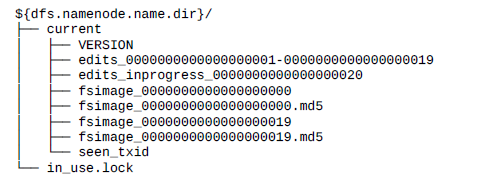
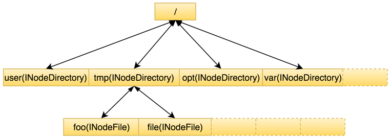

# HDFS 常见问题

#### 1. 副本默认存放策略？

* 如果写请求方所在机器是其中一个 datanode ，则直接存放在本地，否则随机在集群中选择一个 datanode 。
* 第二个副本存放于不同第一个副本的所在的机架。
* 第三个副本存放于第二个副本所在的机架，但是属于不同的节点。
* 剩余的副本就完全随机节点了。

#### 2. hdfs 缓存适用场景？

1. 公共资源文件，比如一些 jar 包等。
2. 热点数据。如 hive 中常用到的表或者部分分区对应的 hdfs 文件。

#### 3. hdfs 如何做到不允许多个客户端并发写？

通过 Lease（租约），Lease 可以看做是一把带时间限制的写锁，仅持有写锁的客户端可以写文件。

#### 4. 租约相关定义？

* 每个客户端用户持有一个租约。
* 每个租约内部包含有一个租约持有者信息，还有此租约对应的文件 Id 列表，表示当前租约持有者正在写这些文件 Id 对应的文件。
* 每个租约内包含有一个最新近更新时间，最近更新时间将会决定此租约是否已过期。过期的租约会导致租约持有者无法继续执行写数据到文件中，除非进行租约的更新。

#### 5. 租约何时释放？

- 客户端显式地请求 NameNode 对某个文件进行 recoverLease 操作；
- Lease 超过 softLimit（默认1m），此时另一客户端申请该文件 Lease；
- Lease 超过 harLimit（默认1h），由 Namenode 的 lmthread 线程发现并执行释放；

#### 6. HDFS 的元数据如何存储？

hdfs 的元数据存储在 NameNode 节点的本地文件中，目录结构如下：

NameNode 在执行 HDFS 客户端提交的创建文件或者移动文件这样的写操作的时候，会**首先把这些操作记录在 EditLog 文件**之中，然后**再更新内存中的文件系统镜像**。

NameNode 会**定期对内存中的文件系统镜像进行 checkpoint 操作**，在磁盘上生成 FSImage 文件，FSImage 文件的文件名形如 fsimage_${end_txid}，其中 ${end_txid} 表示这个 fsimage 文件的结束事务 id。

#### 7. HDFS 的 checkpoint 机制

checkpoint，就是将某一个时间点的内存镜像，完整地存放到磁盘的过程。一般来说有两种：

1. 非 HA 模式下，通过单独的节点，即 Checkpoint Node 或者 Backup Node 完成。
2. HA 模式下，通过 Standby NameNode 完成，完成以后通过 http PUT 方式，将生成的 image 上传给 Active NameNode。

第 2 种更常见。

#### 8. 小文件问题是什么？

小文件指的是小于 HDFS 上 block（hadoop 2.x 后默认为 128M） 大小的文件，而每个文件在元数据中都会占用 150 个字节，因此大量的小文件会给 HDFS NameNode 带来较大的内存压力。

#### 9. 小文件如何产生的？

1. 最初的数据源文件就很小，例如上传的很多小图片等。
2. Spark SQL 在使用动态分区时，如果输入数据有 M 个逻辑分片，一般对应 Spark M 个作业，这个时候如果要写入到目标表的 N 个分区中去的话，最差的情况时每个分区都有来自 M 个作业的数据，那么就会产生 M * N 个结果文件，这个时候一般会有较多的小文件产生。（参考[如何避免Spark SQL做数据导入时产生大量小文件](https://www.jianshu.com/p/ddd2382a738a)）

#### 10. 小文件如何解决？

1. 开发过程中解决：例如修改 Spark SQL，使用 distribute by 分区字段或者使用 HINT 方式，来避免小文件的产生。
2. 后期对小文件进行批量合并：
    * Hadoop Archives：利用 hadoop archive 命令进行归档文件，缺点是一旦创建不可修改、原文件需要手工删除、依赖于 MapReduce、不支持压缩等。
    * SequenceFile 存储方案：利用 MapReduce 将文件合并为 SequeceFile 格式，缺点是依赖于 MapReduce。
    * 其他合并方式：一般根据文件类型的不同，对于某个目录下所有相同类型的小文件进行不同方式的合并。
3. 依赖其他存储系统：比如 HBase 中的 MOB FILE 来专门存储小文件。
4. 从 HDFS 底层解决小文件问题：
    * HDFS-8998，基本思想是把许多小的 Block 合并成一个大 Block，这样一个 block 将包含多个文件，从而减少文件元数据的条数，以此来减少 NN 的内存消耗。
    * HDFS-8286，从解决 NN 管理的元数据入手，将 NN 管理的元数据从保存在内存转向到保存在第三方 KV 存储系统中，以此减缓 NN 的内存使用。

#### 11. Namenode 的命名空间数据结构

在整个 Namespace 目录树中存在两种不同类型的 INode 数据结构：INodeDirectory 和 INodeFile 。其中 INodeDirectory 标识的是目录树中的目录，INodeFile 标识的是目录树中的文件，二者均继承自 INode。