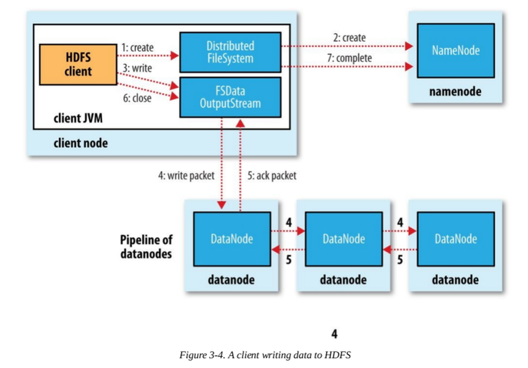

# HDFS 文件读写流程

## 读

### 流程

1. 打开分布式文件：调用分布式文件 DistributedFileSystem.open( ) 方法；
2. 寻址请求：从 NameNode 处得到 DataNode 的地址，DistributedFileSystem使用 RPC 方式调用了NameNode，NameNode 返回存有该副本的DataNode 地址，DistributedFileSystem 返回了一个输入流对象（FSDataInputStream），该对象封装了输入流 DFSInputStream；
3. 连接到DataNode：调用输入流 FSDataInputStream.read( ) 方法从而让DFSInputStream 连接到 DataNodes；
4. 从 DataNode 中获取数据：通过循环调用 read( ) 方法，从而将数据从 DataNode 传输到客户端；
5. 读取另外的 DataNode 直到完成：到达块的末端时候，输入流 DFSInputStream 关闭与 DataNode 连接， 寻找下一个 DataNode；
6. 完成读取，关闭连接：即调用输入流 FSDataInputStream.close( )；

### 容错

读的过程中，有可能失败的原因：

1. 要读取的 DataNode 存在故障，导致连接不上
2. 读取 block 时，进行 checksum 验证不通过

这两种情况，都会从 block 的其他备份所在的 DataNode 继续读取数据，不过如果是 block 出问题还会上报给 NameNode，NameNode 会标记该 block 已经损坏，然后复制 block 达到预期设置的文件备份数 。

## 写

### 流程

1. 客户端调用 DistributedFileSystem 的 create() 方法，开始创建新文件：DistributedFileSystem 创建 DFSOutputStream，产生一个 RPC 调用，让 NameNode 在文件系统的命名空间中创建这一新文件；
2. NameNode 接收到用户的写文件的 RPC 请求后，先要执行各种检查，如客户是否有相关的创建权限和该文件是否已存在等，检查都通过后才会创建一个新文件，并将操作记录到编辑日志，然后 DistributedFileSystem会将 DFSOutputStream 对象包装在 FSDataOutStream 实例中，返回客户端；否则文件创建失败并且给客户端抛 IOException。
3. 客户端开始写文件：DFSOutputStream 会将文件分割成 packets 数据包（一般为 64K），然后将这些 packets 写到其内部的一个叫做 data queue（数据队列）。data queue 会向 NameNode 节点请求适合存储数据副本的 DataNode 节点的列表，然后这些 DataNode 之前生成一个 Pipeline 数据流管道，我们假设副本集参数被设置为 3，那么这个数据流管道中就有 3 个 DataNode 节点。 
4. 首先 DFSOutputStream 会将 packets 向 Pipeline 数据流管道中的第一个 DataNode 节点写数据，第一个DataNode 接收 packets 然后把 packets 写向 Pipeline 中的第二个节点，同理，第二个节点保存接收到的数据然后将数据写向 Pipeline 中的第三个 DataNode 节点。 
5. DFSOutputStream 内部同样维护另外一个内部的写数据确认队列—— ack queue 。当 Pipeline 中的第三个 DataNode 节点将 packets 成功保存后，该节点回向第二个 DataNode 返回一个确认数据写成功的信息，第二个 DataNode 接收到该确认信息后在当前节点数据写成功后也会向 Pipeline 中第一个 DataNode 节点发送一个确认数据写成功的信息，然后第一个节点在收到该信息后如果该节点的数据也写成功后，会将 packets 从 ack queue 中将数据删除。
6. 完成写操作后，客户端调用 close() 关闭写操作，刷新数据； 
7. 在数据刷新完后 NameNode 后关闭写操作流。到此，整个写操作完成。

**简单总结**如下：

1. 客户端调用 create 方法，RPC 调用 NameNode 在命名空间中创建文件；
2. NameNode 做权限和文件存在检查，通过则创建文件并写日志，否则返回异常；
3. 将文件分割为数据包并写入 data queue，向 NameNode 请求将要写入的 DataNode 节点并生成一个 pipeline；
4. 依次向 pipeline 中的每一个 DataNode 节点写数据；
5. 同时维护一个 ack queue，写入成功则从队列中移除；
6. 调用 close 方法，刷新数据；
7. 关闭流。

### 容错

在写数据的过程中，如果其中一个 DataNode 节点写失败了会怎样？

1. Pipeline 数据流管道会被关闭，ack queue（确认队列）中的 packets（数据包）会被添加到 data queue（数据队列）的前面以确保不会发生 packets 的丢失。
2. 在正常的 DataNode 节点上的已保存好的 block 的ID版本会升级——这样发生故障的 DataNode 节点上的block 数据会在节点恢复正常后被删除，失效节点也会被从 Pipeline 中删除。
3. 如果有多个节点的写入失败了，如果满足了最小备份数的设置（dfs.namenode.repliction.min），写入也将会成功，然后剩下的备份会被集群异步的执行备份，直到满足了备份数（dfs.replication）。

## 参考文章

1. [HDFS 1. 读写流程剖析](https://www.jianshu.com/p/7d1bdd23c460)

