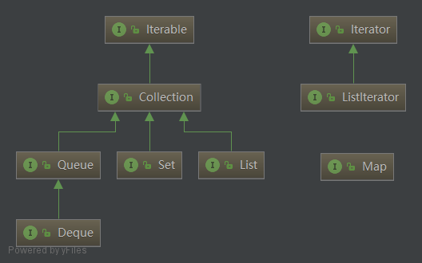
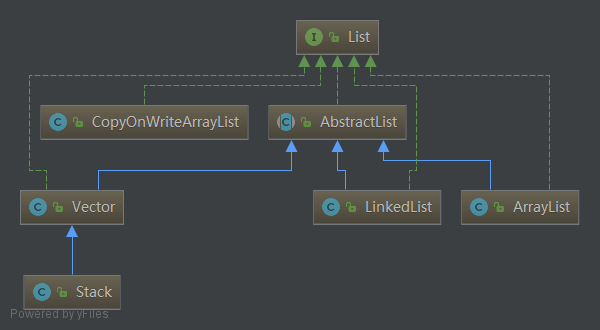
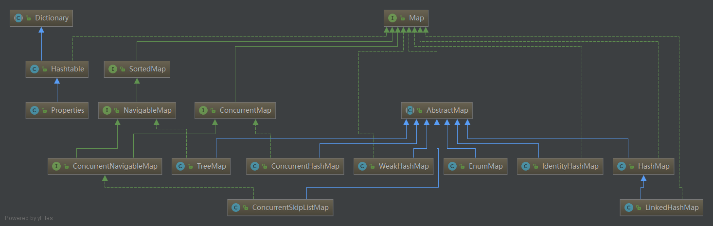
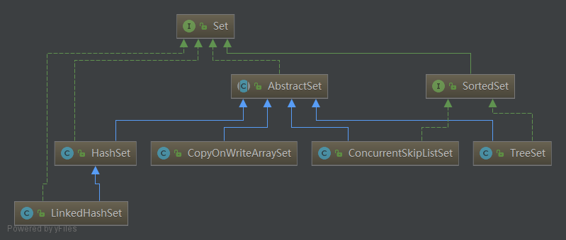
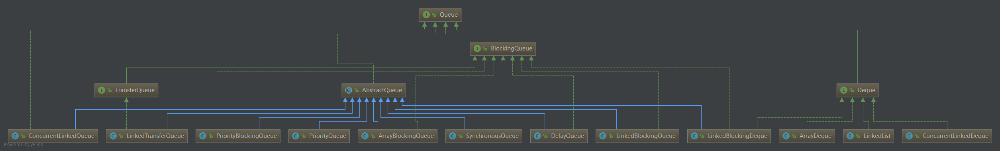
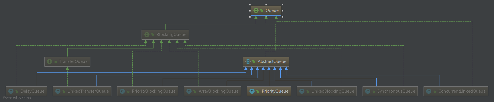
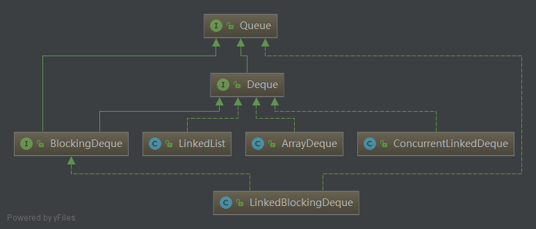

# 集合框架

## 核心接口

可以看到，Java 的集合框架主要包含两种类型的容器：
1. 集合（Collection），存储的是单个元素
2. 映射（Map），存储的是键值对

而 Collection 可以再分类：
1. List，链表
2. Set，存储不重复元素
3. Queue，队列，它有个继承接口——双端队列（Deque）

另外注意两个接口 Iterable 和 Iterator。

Iterator 是迭代器接口，主要包含 hasNext 和 next 方案，用于遍历集合中的元素。而 Iterable 从字面意思也可以看出来，表示可迭代，它提供一个 iterator 方法用于获取一个迭代器。Iterable 的主要用处在于每次调用 iterator 方法获取的都是一个新的从头开始的迭代器，多个迭代器之间互不干扰。

## List

最常用的 List 是：
* ArrayList，基于数组实现的，因此它的问题在于扩容时需要大量复制数据。
* LinkedList，基于链表实现。

另外，还有几个不常用的：
* Vector，它几乎可以认为是 ArrayList 的同步版本，用来解决并发时的问题，它的 add 方法和 get 方法都加上了 synchronized 关键字。
* Stack，它是 Vector 的继承类，所以说是一个线程安全的栈。
* CopyOnWriteArrayList，采用“写时复制”思想，用以解决 ArrayList 在并发时的线程安全问题，可是由于写是需要复制数组而消耗大量资源，因此比较适合读多写少的场景。另外在数据量较大时由于复制比较耗时，可能存在读到旧数据的情况。

## Map

这里最常用的当然是 HashMap，底层使用数组实现，冲突时使用链表，Jdk 1.8 以后做了改进，在链表长度大于 8 以后使用红黑树。

这里可以看到两个顶部接口，Dictionary 和 Map。其中 Dictionary 是已经过时的键值对存储接口了，建议使用的是 Map 接口。其中 HashTable 可以被认为是线程安全的 HashMap，但是也过时了，建议使用的是 ConcurrentHashMap。唯独这里的 Properties 由于可以直接加载配置文件读取键值关系，很实用，所以目前仍然有不少项目在使用。

另外剩下几个接口或者抽象类分别是：

* AbstractMap，它几乎是我们常用 Map 所实现的接口了，其中唯一的抽象方法是 entrySet()，如果自己要实现一个 Map ，可以继承该抽象类。
* SortedMap，Key 有序的接口，使得可以按照顺序进行遍历。
* NavigableMap，扩展了 SortedMap，具有了针对给定搜索目标返回最接近匹配项的方法。
* ConcurrentMap，从 Jdk 1.5 开始引入，在 Map 的基础上，增加了一些方法定义并发时的操作。
* ConcurrentNavigableMap，顾名思义，继承了上面的 NavigableMap 和 ConcurrentMap 两个接口，并且定义了一些根据 Key 的范围获取对应的子映射集合的方法。

除了 HashMap 还有几个使用比较多的 Map 实现，分别是：

* LinkedHashMap，继承了 HashMap，在其基础上加入了双向链表，并提供两种排序方式：插入顺序和访问顺序。
* TreeMap，实现了 NavigableMap 和 AbstractMap 接口，实现原理是红黑树。
* ConcurrentHashMap，支持高并发的 Map 实现，核心思想是通过分段锁，从而减少对锁的竞争。
* ConcurrentSkipListMap，实现了 ConcurrentNavigableMap 和 AbstractMap 接口，底层原理是红黑树，同时应对高并发场景。

此外，有几个不常见的 Map 实现：

* WeakHashMap，一个 Weak 的 HashMap，区别在于键值对可能会被 GC 清除掉。
* EnumMap，一个 Key 为枚举类型的特殊的 Map。
* IdentityHashMap，一个特殊的 Map，判断两个键值 k1 和 k2 相等的条件是 k1 == k2。

## Set

类似于 Map，这里的顶层接口是 Set，下面有两个重要的抽象类或者接口分别是 AbstractSet 和 SortedSet。至于 Set 的具体实现，基本原理就是利用了 Map 中 Key 的唯一性来做的。例如：

* HashSet，基于 HashMap 实现。
* LinkedHashSet，基于 LinkedHashMap 实现。
* TreeSet，基于 TreeMap 实现。
* ConcurrentSkipListSet，基于 ConcurrentSkipListMap 实现。

此外，还有一个基于写时复制原理的 Set —— CopyOnWriteArraySet，是基于上面提到的 CopyOnWriteArrayList 来实现的，至于保证唯一性，是利用了其中的 addIfAbsent 方法。

## Queue

以上是所有队列相关继承关系，可以看到主要分为 Queue 和 Deque（双端队列），下面将这两部分拆开进行介绍。

### Queue

除了 Queue 接口之外，主要有3个接口或者抽象类：

* AbstractQueue，实现了队列的几个基本操作：add、remove、element 方法。
* BlockingQueue，定义了一个阻塞队列，即在队列为空时读取元素时等待，在队列满时写入元素等待。
* TransferQueue，继承 BlockingQueue，生产者会一直阻塞直到所添加到队列的元素被某一个消费者所消费。新添加的 transfer 方法用来实现这种约束。顾名思义，阻塞就是发生在元素从一个线程 transfer 到另一个线程的过程中，它有效地实现了元素在线程之间的传递。

可以看到所有队列实现类都实现了 AbstractQueue 接口，因此根据有无实现 BlockingQueue 接口，可以将队列分为两类：

1. 非阻塞队列

* PriorityQueue，优先队列，通过数组表示的小顶堆实现，非线程安全的。
* ConcurrentLinkedQueue，由链表实现，并且支持多线程下的安全操作。

2. 阻塞队列

* PriorityBlockingQueue，一个阻塞的优先队列，同 PriorityQueue 类似通过数组表示的小顶堆实现，但通过 ReentrantLock 保证了线程安全。
* ArrayBlockingQueue，一个由数组实现的有界队列，因此创建时必须指定大小。
* LinkedBlockingQueue，由链表实现，与 ArrayBlockingQueue 不同的是大小不需要指定，优点在于可以无限增长，另外不同于前者在生产和消费时使用相同的锁，而它对 take 和 put 操作使用不同的锁从而减少了并发时的锁竞争，但有个缺点在于入队时要将元素包装为 Node 对象，增大了内存开销。在 Executors 中的 newFixedThreadPool 和 newSingleThreadExecutor 有使用。
* SynchronousQueue，是一个非常特殊的阻塞队列，它不存储元素。每一个 put 操作必须要等待一个 take 操作，否则不能继续添加元素，反之亦然。在 Executors 中的 newCachedThreadPool 中有使用。
* LinkedTransferQueue，实现了 TransferQueue 接口。
* DelayQueue，内部存储结构使用 PriorityQueue，使用 ReentrantLock 和 Condition 来控制并发安全，常用于定时任务。不过 Executors 中的 newScheduledThreadPool 使用的内部定义的 DelayedWorkQueue，内部用数组存储，原理和 DelayQueue 类似。

### Deque

既然是双端队列，所以我们可以拿来用作链表、栈、队列，都是可以的，下面依次介绍下：

* LinkedList，由链表实现的双端队列，在上面的 List 小节中我们已经见过，这次它又出现在这里，证明了它的功能强大。
* ArrayDeque，由数组实现，如果队列大小有限，那么使用它会比 LinkedList 更合适。
* ConcurrentLinkedDeque，同样由链表实现，并且支持多线程下的安全操作。
* LinkedBlockingDeque，实现了 BlockingQueue 接口，是一个阻塞的双端队列，也是基于链表实现。
