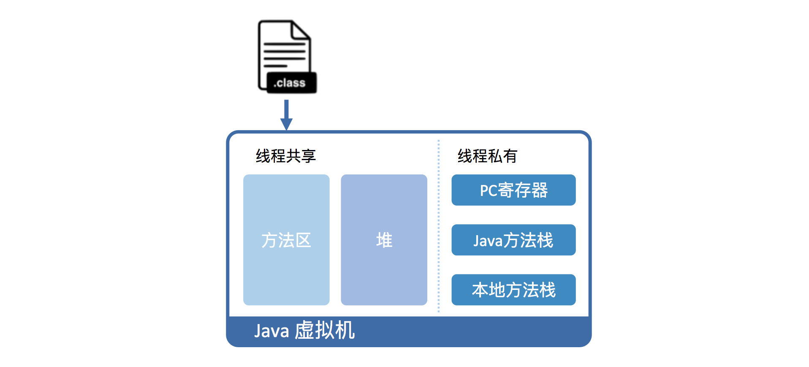

# JVM 基础

## Java 的运行原理

Java 需要在 JVM 上运行。核心过程是编译器将 Java 代码转换成 JVM 能够识别的指令序列，即 Java 字节码。然后由各个操作系统上的 JVM 来将 Java 字节码翻译成机器可以识别的机器码，最后进行执行。这正是 Java 诞生之初的强大之处——一次编译，到处运行。通过 JVM 屏蔽了底层操作系统的细节，让 Java 成为真正的高级语言。

## Java 内存管理

如图所示，class 文件会被加载到 Java 虚拟机中，加载后的 Java 类存在于**方法区**，实际运行时会执行方法区的代码。

Java 运行时，又将内存划分出堆和栈，其中栈再细分为：面向 Java 方法的 **Java 方法栈**、面向本地方法（用 C++ 写的 native 方法）的**本地方法栈**、以及存放各个线程执行位置的 **PC 寄存器**。

在运行过程中，每当调用进入一个 Java 方法，Java 虚拟机会在当前线程的 Java 方法栈中生成一个栈帧，用以存放局部变量以及字节码的操作数。这个栈帧的大小是提前计算好的，而且 Java 虚拟机不要求栈帧在内存空间里连续分布。

当退出当前执行的方法时，不管是正常返回还是异常返回，Java 虚拟机均会弹出当前线程的当前栈帧，并将之舍弃。

将 Java 简单区分为堆内存和栈内存是很粗糙的，实际比这复杂。

下面我们可以简单记忆：

**方法区**：存储JVM加载的类、常量、静态变量等；

**堆**：存放对象实例，是 JVM 中内存最大的一块，是 GC 管理的主要区域，又称 GC 堆；

**Java 方法栈**：又称 Java 虚拟机栈，描述的是Java方法执行的内存模型，主要用于存储执行方法时创建的栈帧。

**本地方法栈**：类似于 Java 方法栈，只不过为本地方法（用 C++ 写的 native 方法）服务。

**PC 寄存器**：又称程序计数器，在多线程程序中，为了让线程切换后能够恢复到正确的执行位置，每个线程都需要维护一个独立的计数器，便存在此区域。*另外，该区域占用内存较小，且是JVM规范中唯一没有定义 OutOfMemoryError 情况的区域*。

此外，

**元空间**：元空间的本质和永久代类似，都是对JVM规范中方法区的实现。不过元空间与永久代之间最大的区别在于：元空间并不在虚拟机中，而是使用本地内存。 

从线程角度来看的话：

* **线程共享**：方法区、堆、直接内存（不属于 JVM 管理范围）
* **线程私有**：Java 方法栈、本地方法栈、PC 寄存器

## Java 字节码翻译

翻译形式有两种：

1. 解释执行，即逐条将字节码翻译为机器码并执行；
2. 即时编译（Just-In-Time, JIT）,即将一个方法的所有字节码编译成机器码后再执行。

前者的优势在于无需等待编译，而后者的优势在于实际运行速度更快。HotSpot 默认采用混合模式，综合了解释执行和即时编译两者的优点。它会先解释执行字节码，而后将其中反复执行的热点代码，以方法为单位进行即时编译。