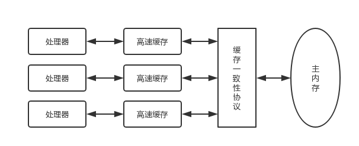

# Java 内存模型

## 为什么有内存模型

之所以有内存模型这个问题，根源在于处理器与内存之间的速度的差异实在太大，因而现代计算机不得不加入一个接近与处理器速度的高速缓存来作为内存和处理器之间的缓冲：将所需数据复制到高速缓存中进行运算，运算结束后将结果从缓存同步到内存。这带来一个新的问题：如何解决缓存的一致性问题？

为了解决这个问题和更好地定义内存和高速缓存之间的同步策略等，这里便需要定义一个内存模型。所以内存模型指的是在特定的操作协议下，对特定的内存或高速缓存进行读写的过程抽象。

下面是处理器、高速缓存、主内存之间的关系，也正是内存模型的作用范围：

## 为什么有 Java 内存模型

这是为了让 Java 程序在各种平台下都能达到一致的内存访问效果，那么就需要在 JVM 规范（JSR-133）中定义一种 Java 内存模型（Java Memory Model, JMM）来屏蔽掉各种硬件和操作系统的内存访问差异。

## 主内存和工作内存

Java 内存模型规定了所有的变量都存储在主内存（可以与硬件上的内存类比），此外每个线程还有自己的工作内存（可以与高速缓存类比），保存了该线程使用到的变量的主内存副本拷贝（实际一般不会拷贝整个对象，但可能拷贝对象的引用或者对象中的某个成员）。另外线程之间也不能访问对方的工作内存。它们之间的关系如下图所示：

## 内存间交互操作

关于主内存和工作内存之间的交互，Java 内存模型规定了以下8种操作来完成，虚拟机在实现时必须保证每一个操作都是原子的、不可再分的。

* lock：把主内存的变量标识为一条线程独占的状态
* unlock：把主内存的锁定的变量释放出来，这样才能被其他线程锁定
* read：读取到工作内存
* load：把read结果放入工作内存的变量中
* use：将工作内存的变量的值传给执行引擎
* assign：将从执行引擎收到的值赋给工作内存的变量
* store：将工作内存的变量的值传到主内存
* write：将store的结果放入主内存的变量中

## 先行发生原则

**定义**：如果有两个操作 A 和 B 存在 A Happens-Before B，那么操作 A 对变量的修改对操作 B 来说是可见的。

这个原则限定了指令不能重排的范围。

具体表现形式有：

* 线程内执行的每个操作，都保证 happen-before 后面的操作，这就保证了基本的程序顺序规则，这是开发者在书写程序时的基本约定。
* 对于 volatile 变量，对它的写操作，保证 happen-before 在随后对该变量的读取操作。
* 对于一个锁的解锁操作，保证 happen-before 加锁操作。
* 对象构建完成，保证 happen-before 于 finalizer 的开始动作。
* 甚至是类似线程内部操作的完成，保证 happen-beforre 其他 Thread.join() 的线程等。

另外还有**传递性**——如果满足 a happen-before b 和 b happen-before c，那么 a happen-before c 也成立。