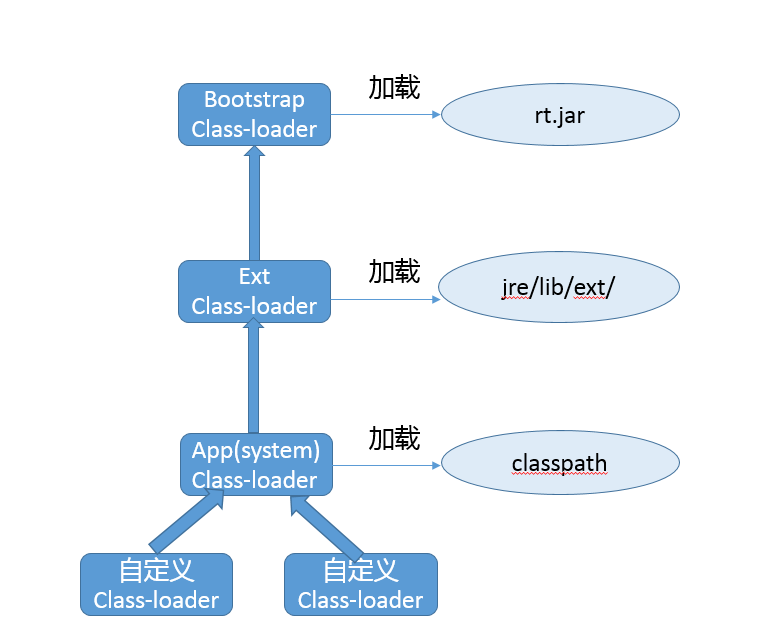

# 类加载

## 定义

把类的数据从class文件加载到内存，并对数据进行校验、转换解析和初始化，最终形成可以被虚拟机直接使用的Java类型，这就是虚拟机的类加载机制。

## 类加载的过程

### 加载（Loading）

将Java字节码从不同的数据源（class文件、jar包、网络等）读取到JVM中，并映射为Class对象。

而这一过程（根据全限定名来查找二进制字节流）需要借助类加载器来完成。

这里不得不提的是类加载的一个模型——双亲委派模型（*parent*-delegation model，貌似翻译为父辈代理模型更加合适）。

**基本描述**是：如果一个类加载器收到了类加载的请求，首先会把该请求委托给父类加载器去完成。

####双亲委派模型

**优点**：解决了各个类加载器的基础类的统一问题，即越基础的类由越上层的加载器进行加载。 

**缺点**：基础类之所以“基础”，是因为总是作为被用户调用的API，但是如果基础类需要调用用户的代码，该怎么办呢？

**解决**：引入了线程上下文类加载器（Thread Context ClassLoader），通过Thread.setContextClassLoader使用其中的类加载器来加载类。

### 链接（Linking）

指的是将创建成的Class对象合并至JVM中，使之能够运行。具体又分为3个步骤：

1. 验证

   验证被加载的类是否满足JVM的规范。

2. 准备

   为被加载类的静态字段分配内存。

3. 解析

   将常量池中的符号引用替换为直接引用。如果符号引用指向一个未被加载的类，或者未被加载类的字段或方法，那么解析将触发这个类的加载（但未必触发这个类的链接以及初始化）。

### 初始化（Initialization）

真正去执行类初始化的代码逻辑，包括静态字段的赋值、执行静态初始化块的逻辑、

#### 什么时候会进行初始化

1. new一个对象时、读取或者设置一个类的静态字段（被final修饰、已在编译期把结果放入常量池的静态字段除外）时、调用一个类的静态方法的时候；
2. 使用java.lang.reflect包的方法对类进行发射调用，且该类没有被初始化的时候；
3. 当初始化一个类，发现其父类没有进行过初始化，则需要先对父类进行初始化；
4. main方法所在的类；
5. 当使用 JDK 1.7 的动态语言支持时，如果一个 java.lang.invoke.MethodHandle 实例最后的解析结果 REF_getStatic, REF_putStatic, REF_invokeStatic 的方法句柄，并且这个方法句柄所对应的类没有进行过初始化，则需要先触发其初始化。