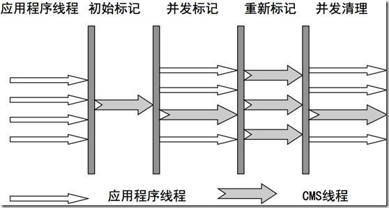
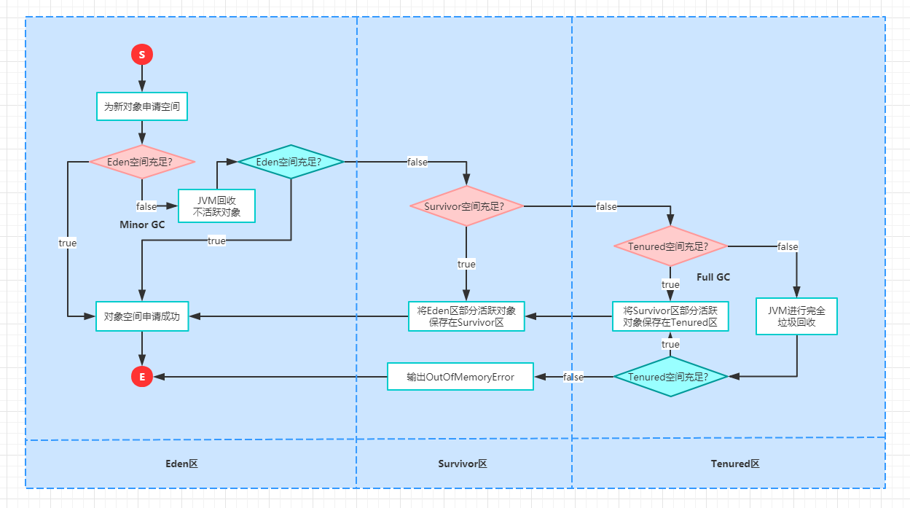
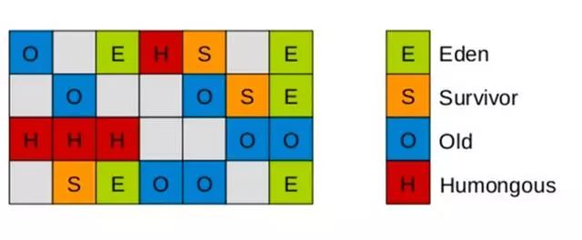

# JVM 中的垃圾回收（GC）

## 什么是垃圾回收

首先问题当然是垃圾是什么？垃圾就是不再使用的对象，那么垃圾回收就是回收这些不再使用的对象，即释放它们占用的内存。

## 什么垃圾需要回收

Java 方法栈、本地方法栈、PC 寄存器会随着方法结束或者线程结束而回收内存，所以这些区域的内存分配和回收都具备确定性，不需要额外考虑回收的问题。而堆和方法区存储的对象可能只有在运行期间才确定的，这部分内存的分配和回收都是动态的，垃圾回收关注的也是这部分。而由于堆中存储的是大对象，是最容易 OOM 的地方，所以下面的**垃圾回收主要针对的是堆**的，最后稍微说一下方法区的内存回收。

## 垃圾回收的步骤

很显然，先找到它们，然后释放对应内存：

1. 查找内存中不再使用的对象
2. 释放这些对象占用的内存

下面就这两块进行具体介绍

### 查找内存中不再使用的对象

如何定义不再使用呢？一般有以下两个方法——

1. **引用计数算法**

   给对象添加一个引用计数器，每当一个地方引用它则计数器加 1；当引用失效，则计数器减 1。计数器为 0 的对象就是不可能再被使用的。这种方法的缺点就是不能检测到环的存在。

2. **可达性分析算法**

   基本思路就是通过一系列名为”GC Roots”的对象作为起始点，从这些节点开始向下搜索，搜索所走过的路径称为引用链（Reference Chain），当一个对象到 GC Roots 没有任何引用链相连时，则证明此对象是可回收的。

**JVM 采用的就是可达性分析算法**。

### 释放这些对象占用的内存

如何释放？这就涉及到了垃圾收集算法了——

#### 垃圾收集算法

1. **标记-清理算法**

   标记清理算法分为“标记”和“清理”两个阶段：**首先标记出需要回收的对象，标记完成之后统一清理对象**。它的优点是效率高，缺点是**容易产生内存碎片。**

2. **标记-复制算法**

   它**将可用内存容量划分为大小相等的两块，每次只使用其中的一块**。当这一块用完之后，就将还存活的对象复制到另外一块上面，然后在把已使用过的内存空间一次理掉。它的优点是**实现简单，效率高，不会存在内存碎片**。**缺点就是需要 2 倍的内存来管理**。

3. **标记-整理算法**

   标记操作和“标记-清理”算法一致，后续操作不只是直接清理对象，而是在清理无用对象完成后让所有 存活的对象都向一端移动，并更新引用其对象的指针。因为**要移动对象**，所以它的效率要比“标记-清理”效率低，但是**不会产生内存碎片**。

有了找到垃圾的算法，也有了收集垃圾的算法了，那么接下来就是开干了吧，开始实现具体的垃圾收集器吧！然而我们并不是这么鲁莽，考虑到对象的存活时间有长有短，所以对于存活时间长的对象，减少被 GC 的次数可以避免不必要的开销。这样我们就**把内存分成新生代和老年代，新生代存放刚创建的和存活时间比较短的对象，老年代存放存活时间比较长的对象。**这样每次仅仅清理年轻代，老年代仅在必要时时再做清理可以极大的提高GC效率，节省GC时间。

上面便是**分代收集**的思想了，后面介绍的垃圾收集器也基本是基于这个思想来进行开发的。

## 垃圾收集器的历史

### 第一阶段，Serial（串行）收集器

在 jdk1.3.1 之前，JVM 仅仅能使用 Serial 收集器。 Serial 收集器是一个单线程的收集器，但它的“单线程”的意义并不仅仅是说明它只会使用一个 CPU 或一条收集线程去完成垃圾收集工作，更重要的是在它进行垃圾收集时，必须暂停其他所有的工作线程，直到它收集结束。

### 第二阶段，Parallel（并行）收集器

Parallel 收集器也称吞吐量收集器，相比 Serial 收集器，Parallel 最主要的优势在于使用多线程去完成垃圾清理工作，这样可以充分利用多核的特性，大幅降低 GC 时间。

### 第三阶段，CMS（并发）收集器

CMS 收集器在 Minor GC 时会暂停所有的应用线程，并以多线程的方式进行垃圾回收。在 Full GC 时不再暂停应用线程，而是使用若干个后台线程定期的对老年代空间进行扫描，及时回收其中不再使用的对象。

### 第四阶段，G1（并发）收集器

G1 收集器（或者垃圾优先收集器）的设计初衷是为了尽量缩短处理超大堆（大于 4GB）时产生的停顿。相对于CMS 的优势而言是内存碎片的产生率大大降低。

## 垃圾收集器的种类

新生代的收集器：

1. Serial
2. PraNew
3. Parallel Scavenge

老年代的收集器：

1. Serial Old
2. Parallel Old
3. CMS（Concurrent Mark Sweep）

回收整个 Java 堆（新生代和老年代）：

1. G1（Garbage-First）

单代

1. ZGC（The Z Garbage Collector）

### 相关概念

一般来说，垃圾收集器有两个关注点：

1. **减少停顿（STW, Stop The World）**
  在垃圾收集时，有时候需要暂停其他所有的工作线程，直到收集结束。所以被称为“Stop The World”，简称“STW”。
2. **提高吞吐量**
  吞吐量就是 CPU 用于运行用户代码的时间与 CPU 总消耗时间的比值，即吞吐量 = 运行用户代码时间 /（运行用户代码时间 + 垃圾收集时间）。假设虚拟机总共运行了 100 分钟，其中垃圾收集花掉 1 分钟，那吞吐量就是 99%。

#### 并行与并发

* **并行（Parallel）**：多条垃圾收集线程并行工作，但此时用户线程仍然处于等待状态。
* **并发（Concurrent）**：用户线程与垃圾收集线程同时执行（但不一定是并行的，可能会交替执行），用户程序在继续运行。而垃圾收集程序运行在另一个 CPU 上。

看垃圾收集器的发展史，基本上就是**串行 -> 并行 -> 并发**。

### Serial 收集器（标记-复制算法）

Serial收集器是新生代单线程收集器，优点是简单高效，算是最基本、发展历史最悠久的收集器。它在进行垃圾收集时，必须暂停其他所有的工作线程，直到它收集完成。

Serial 收集器依然是虚拟机运行在 Client 模式下默认新生代收集器，对于运行在 Client 模式下的虚拟机来说是一个很好的选择。

### ParNew 收集器（标记-复制算法）

ParNew 收集器是**新生代并行收集器**，其实就是 Serial 收集器的多线程版本。

除了使用多线程进行垃圾收集之外，其余行为包括 Serial 收集器可用的所有控制参数、收集算法、Stop The World、对象分配规则、回收策略等都与 Serial 收集器完全一样。

### Parallel Scavenge 收集器（标记-复制算法）

Parallel Scavenge 收集器是新生代并行收集器，追求高吞吐量，高效利用 CPU。

停顿时间越短就越适合需要与用户交互的程序，良好的响应速度能提升用户体验，而高吞吐量则可用高效率地利用CPU 时间，尽快完成程序的运算任务，主要适合在后台运算而不需要太多交互的任务。

### Serial Old 收集器（标记-整理算法）

Serial Old 是 Serial 收集器的老年代版本，它同样是一个单线程（串行）收集器，使用标记整理算法。这个收集器的主要意义也是在于给 **Client 模式**下的虚拟机使用。

如果在 **Server 模式**下，主要两大用途：

1. 在 Jdk 1.5以及之前的版本中与 Parallel Scavenge 收集器搭配使用
2. 作为 CMS 收集器的后备预案，在并发收集发生 Concurrent Mode Failure 时使用

### Parallel Old 收集器（标记-整理算法）

Parallel Old 是Parallel Scavenge 收集器的老年代版本，使用多线程和“标记-整理”算法。这个收集器在 Jdk 1.6 中才开始提供。

### CMS 收集器（标记-清理算法）

CMS（Concurrent Mark Sweep）收集器是一种以获取最短回收停顿时间为目标的收集器。

目前很大一部分的 Java 应用集中在互联网站或者 B/S 系统的服务端上，这类应用尤其重视服务器的响应速度，希望系统停顿时间最短，以给用户带来较好的体验。CMS 收集器就非常符合这类应用的需求。

CMS 收集器是基于“标记-清理”算法实现的，它的运作过程相对前面几种收集器来说更复杂一些，整个过程分为4个步骤：

1. 初始标记；
2. 并发标记；
3. 重新标记；
4. 并发清理。

其中，初始标记、重新标记这两个步骤仍然需要“Stop The World”

CMS 收集器主要优点：

1. 并发收集；
2. 低停顿。

CMS 3 个明显的缺点：

1. CMS 收集器对 CPU 资源非常敏感，在本来 CPU 负载就比较高的情况下，还分出至少 25%（默认值）的 CPU 资源去执行收集器线程，可能导致用户程序执行速度下降严重；
2. CMS 收集器无法处理浮动垃圾，可能出现“Concurrent Mode Failure”失败而导致另一次Full GC的产生。在 JDK1.5 的默认设置下，CMS 收集器当老年代使用了 68% 的空间后就会被激活。
3. CMS 是基于“标记-清理”算法实现的收集器，收集结束时会有大量空间碎片产生。空间碎片过多，可能会出现老年代还有很大空间剩余，但是无法找到足够大的连续空间来分配当前对象，不得不提前出发 Full GC。

### G1 收集器（标记-整理算法）

Jdk 1.7 后全新的回收器, 用于取代 CMS 收集器，Java 9 中默认使用G1。

G1 收集器的优势：

1. 独特的分代垃圾回收器,分代 GC：分代收集器，同时兼顾年轻代和老年代；
2. 使用分区算法，不要求 eden，年轻代或老年代的空间都连续；
3. 并行性：回收期间, 可由多个线程同时工作, 有效利用多核cpu资源；
4. 空间整理：回收过程中，会进行适当对象移动，减少空间碎片；
5. 可预见性：G1可选取部分区域进行回收，可以缩小回收范围，减少全局停顿。

G1 收集器的运作大致可划分为以下步骤：

1. 初始标记

   这个阶段是 STW 的，所有应用线程会被暂停，标记出从 GC Roots 开始直接可达的对象。

2. 并发标记

   从 GC Roots 开始对堆中对象进行可达性分析，找出存活对象，耗时较长。当并发标记完成后，开始最终标记（Final Marking）阶段。

3. 最终标记

   标记那些在并发标记阶段发生变化的对象，将被回收

4. 筛选回收

   首先对各个 Regin 的回收价值和成本进行排序，根据用户所期待的 GC 停顿时间指定回收计划，回收一部分 Region

### ZGC 收集器

ZGC 是在 JDK11 发布的，而且性能意想不到的优秀！在 SPECjbb 2015 基准测试，在 128G 的大堆下，最大停顿时间才 **1.68ms**。这与平均停顿时间超过 200 毫秒的 G1 和 Parallel 形成鲜明的对比，感觉 Java 程序员以后可以摆脱 JVM 调优了。

这里不做过多介绍，感兴趣的可以阅读文末的参考文章。

下图是上面几种垃圾收集器在新生代和老年代的组合方式：

## 内存划分

### G1 之前的 JVM 内存划分

- 新生代：伊甸园区（eden）+ 2个幸存区（Survivor）
- 老年代
- 持久代(perm space)：JDK1.8 之前
- 元空间(metaspace)：JDK1.8 之后取代持久代

此时的 **GC 流程**如下图所示：

注意：这里的 Survivor 实际上是有两块的，一般新生代的内存比例是——

Eden : Survivor(from) : Survivor(to) = 8:1:1，也就是说新生代会浪费 10% 的空间。

1. 当有一个新对象产生，需要分配空间；
2. 首先会判断 Eden 是否有内存空间，如果有内存空间，则直接将新对象保存在 Eden ；
3. 如果 Eden 内存空间不足，会自动执行 Minor GC操作，将 Eden 无用的内存空间进行清理；清理之后会判断 Eden 的内存空间是否充足？如果内存空间充足则将新的对象在 Eden 进行分配；
4. 如果执行了 Minor GC 操作，发现 Eden 内存依然不足，那么会判断 Survivor ，如果 Survivor 有内存空间，那么会把 Eden 和 Survivor 中的部分活跃对象一次性复制到另一块 Survivor，随后继续判断 Eden 的空间是否充足，如果充足，则在 Eden 进行新对象内存空间的分配；
5. 如果此时 Survivor 也已没有内存空间，那么判断老年区，如果此时老年区空间充足，则将 Survivor 中的活跃对象保存到老年区，而后 Survivor 就会出现空余空间，而后 Eden 将活跃对象保存在存活区之中，而后在 Eden 中为新对象开辟空间；
6. 如果此时老年代也是满的，此时将产生 Major GC（Full GC），进行老年代的内存清理；
7. 如果老年代执行了 Full GC 之后，发现依然无法实现对象的保存，就会产生 OOM 异常（OutOf MemoryError）。

### G1 收集器的 JVM 内存划分

**G1 堆内存结构**

堆内存会被切分成为很多个固定大小区域（Region），每个是连续范围的虚拟内存。

堆内存中一个区域（Region）的大小可以通过 -XX:G1HeapRegionSize 参数指定，大小区间最小 1M、最大 32M，总之是 2 的幂次方。

默认把堆内存按照 2048 份均分。

**G1 堆内存分配**

每个 Region 被标记了 E、S、O 和 H，这些区域在逻辑上被映射为 Eden，Survivor 和老年代。

存活的对象从一个区域转移（即复制或移动）到另一个区域。区域被设计为并行收集垃圾，可能会暂停所有应用线程。

如上图所示，区域可以分配到 Eden，Survivor 和老年代。此外，还有第四种类型，被称为巨型区域（Humongous Region）。Humongous 区域是为了那些存储超过50%标准 Region 大小的对象而设计的，它用来专门存放巨型对象。如果一个 H 区装不下一个巨型对象，那么 G1 会寻找连续的H分区来存储。为了能找到连续的H区，有时候不得不启动 Full GC。

## 方法区（1.8 后是元空间，之前是永久代）的垃圾回收

上面介绍的都是 Java 堆的内存回收，而方法区的垃圾回收主要回收废弃常量和无用的类，判断常量是否废弃比较简单，而判断一个类是否无用，需要以下条件都成立：

1. 该类的所有实例都已经被回收；
2. 加载该类的 ClassLoader 已经被回收；
3. 该类对应的 java.lang.Class 对象没有在任何地方被引用，无法在任何地方通过反射访问该类的方法。

## 参考文章

1. [深入理解 Java G1 垃圾收集器](http://blog.jobbole.com/109170/)
2. [深入剖析JVM：G1收集器+回收流程+推荐用例](https://zhuanlan.zhihu.com/p/59861022)
3. 周志明的《深入理解Java虚拟机——JVM高级特性与最佳实践》
4. [Our Collectors](https://blogs.oracle.com/jonthecollector/our-collectors)
5. [关于JVM的类型和模式](http://www.importnew.com/20715.html)
6. [Java程序员的荣光，听R大论JDK11的ZGC](https://mp.weixin.qq.com/s/KUCs_BJUNfMMCO1T3_WAjw)
7. [Oracle 即将发布的全新 Java 垃圾收集器 ZGC](https://www.infoq.cn/article/oracle-release-java-gc-zgc)