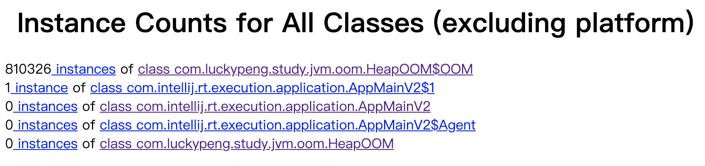

# OutOfMemoryError 异常

除了PC寄存器（或者称为程序计数器）之外，JVM的其他几个内存区域都会有发生`OutOfMemorryError`（简称`OOM`）异常的可能。

## Java堆溢出

Java堆用于存储对象实例，只要不断创建对象，切保证GC Roots到对象之间有可达路径来避免垃圾回收机制清除这些对象，那么对象数量达到最大堆的容量限制后就会产生内存溢出异常。

```java
/**
 * 堆内存溢出
 * VM Args: -Xms20m -Xmx20m -XX:+HeapDumpOnOutOfMemoryError
 * 生成的 .jprof 文件可以用 jhat [file] 命令，会在本地启动一个 webservice，以便进一步定位问题
 * @author coalchan
 */
public class HeapOOM {
    static class OOM {}

    public static void main(String[] args) {
        List<OOM> list = new ArrayList<>();
        while (true) {
            list.add(new OOM());
        }
    }
}
```

运行结果：

```
java.lang.OutOfMemoryError: Java heap space
Dumping heap to java_pid2680.hprof ...
Heap dump file created [27772696 bytes in 0.090 secs]
Exception in thread "main" java.lang.OutOfMemoryError: Java heap space
```

解决思路：

分析堆转储快照文件，最简单的可以使用jdk自带的jhat命令分析，也可以使用更加高级的一些可视化工具。以上实例中，通过运行`jhat java_pid2680.hprof`，访问`http://localhost:7000`可以看到如下页面信息：


这里便可以进一步定位问题了。

实际问题可能比这个要复杂，一般首先是要确认出现了**内存泄漏**（Memory Leak）还是**内存溢出**（Memory Overflow）。

1. 内存泄漏

   通过工具查看泄漏对象到GC Roots的引用链，就能知道是什么路径导致不能回收。

2. 内存溢出

   查看堆参数（`Xms`和`Xmx`）能否调大，另外看看某些对象是不是存储周期过长或者不必要等。

## 虚拟机栈和本地方法栈溢出

