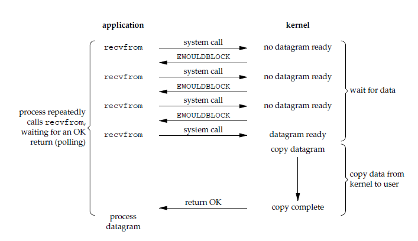
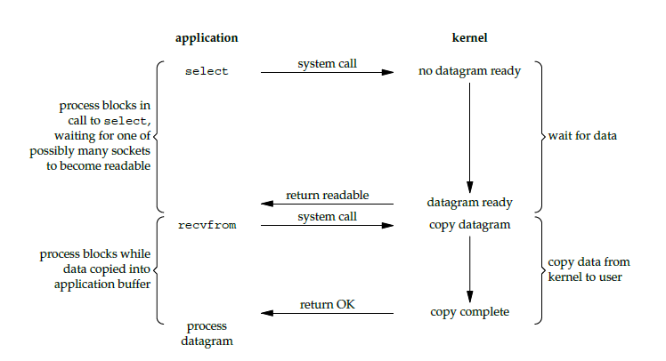
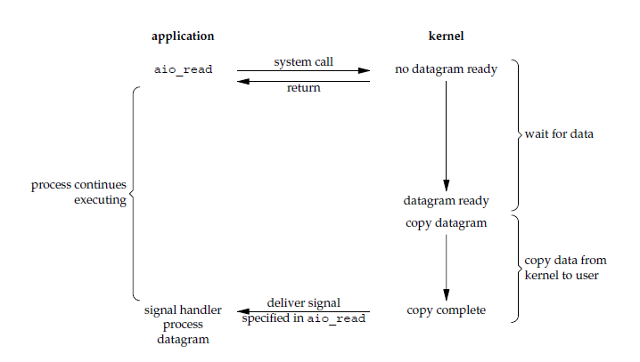

# I/O 模型

## 相关概念

### 同步和异步

描述的是用户线程与内核的交互方式：

- **同步**是指用户线程发起 I/O 请求后需要等待或者轮询内核 I/O 操作完成后才能继续执行；
- **异步**是指用户线程发起 I/O 请求后仍继续执行，当内核 I/O 操作完成后会通知用户线程，或者调用用户线程注册的回调函数。

### 阻塞和非阻塞

描述的是用户线程调用内核 I/O 操作的方式：

- **阻塞**是指 I/O 操作需要彻底完成后才返回到用户空间；
- **非阻塞**是指 I/O 操作被调用后立即返回给用户一个状态值，无需等到 I/O 操作彻底完成。

一个 I/O 操作其实分成了两个步骤：**发起 I/O 请求**和**实际的 I/O 操作**。 

阻塞 I/O 和非阻塞 I/O 的区别在于第一步，发起 I/O 请求是否会被阻塞，如果阻塞直到完成那么就是传统的阻塞 I/O ，如果不阻塞，那么就是非阻塞 I/O 。 同步 I/O 和异步 I/O 的区别就在于第二个步骤是否阻塞，如果实际的 I/O 读写阻塞请求进程，那么就是同步 I/O 。

## Unix I/O 模型

Unix 下共有五种 I/O 模型：

1. 阻塞 I/O
2. 非阻塞 I/O
3. I/O 复用（select 和 poll）
4. 信号驱动 I/O（SIGIO）
5. 异步 I/O（POSIX 的 aio_系列函数）

### 阻塞 I/O（Blocking I/O）

请求无法立即完成则保持阻塞。

- 阶段1：等待数据就绪。网络 I/O 的情况就是等待远端数据陆续抵达；磁盘I/O的情况就是等待磁盘数据从磁盘上读取到内核态内存中。
- 阶段2：数据从内核拷贝到进程。出于系统安全,用户态的程序没有权限直接读取内核态内存,因此内核负责把内核态内存中的数据拷贝一份到用户态内存中。

### 非阻塞 I/O（Non-Blocking I/O）

- socket 设置为 NONBLOCK（非阻塞）就是告诉内核，当所请求的 I/O 操作无法完成时，不要将进程睡眠，而是返回一个错误码(EWOULDBLOCK) ，这样请求就不会阻塞
- I/O 操作函数将不断的测试数据是否已经准备好，如果没有准备好，继续测试，直到数据准备好为止。整个 I/O 请求的过程中，虽然用户线程每次发起 I/O 请求后可以立即返回，但是为了等到数据，仍需要不断地轮询、重复请求，消耗了大量的 CPU 的资源
- 数据准备好了，从内核拷贝到用户空间。

一般很少直接使用这种模型，而是在其他 I/O 模型中使用非阻塞 I/O 这一特性。这种方式对单个 I/O 请求意义不大,但给 I/O 多路复用铺平了道路。

### I/O 复用（Multiplexing I/O）

I/O 多路复用会用到 select 或者 poll 函数，这两个函数也会使进程阻塞，但是和阻塞 I/O 所不同的的，这两个函数可以同时阻塞多个 I/O 操作。而且可以同时对多个读操作，多个写操作的 I/O 函数进行检测，直到有数据可读或可写时，才真正调用 I/O 操作函数。

从流程上来看，使用 select 函数进行 I/O 请求和同步阻塞模型没有太大的区别，甚至还多了添加监视 socket，以及调用 select 函数的额外操作，效率更差。但是，使用 select 以后最大的优势是用户可以在一个线程内同时处理多个 socket 的 I/O 请求。用户可以注册多个 socket，然后不断地调用 select 读取被激活的 socket，即可达到在同一个线程内同时处理多个 I/O 请求的目的。而在同步阻塞模型中，必须通过多线程的方式才能达到这个目的。

I/O 多路复用模型使用了 Reactor 设计模式实现了这一机制。

调用 select / poll 该方法由一个用户态线程负责轮询多个 socket,直到某个阶段1的数据就绪,再通知实际的用户线程执行阶段2的拷贝。通过一个专职的用户态线程执行非阻塞I/O轮询，模拟实现了阶段一的异步化。

### 信号驱动 I/O（Signal-Driven I/O）

首先我们允许 socket 进行信号驱动 I/O,并安装一个信号处理函数，进程继续运行并不阻塞。当数据准备好时，进程会收到一个 SIGIO 信号，可以在信号处理函数中调用 I/O 操作函数处理数据。

### 异步 I/O（Asynchronous I/O）

调用 aio_read 函数，告诉内核描述字，缓冲区指针，缓冲区大小，文件偏移以及通知的方式，然后立即返回。当内核将数据拷贝到缓冲区后，再通知应用程序。

异步 I/O 模型使用了 Proactor 设计模式实现了这一机制。

告知内核,当整个过程(包括阶段1和阶段2)全部完成时,通知应用程序来读数据。

## 几种 I/O 模型的比较

前四种模型的区别是阶段1不相同，阶段2基本相同，都是将数据从内核拷贝到调用者的缓冲区。而异步 I/O 的两个阶段都不同于前四个模型。

同步 I/O 操作引起请求进程阻塞，直到 I/O 操作完成。异步 I/O 操作不引起请求进程阻塞。

目前 Windows 下通过 IOCP 实现了真正的异步 I/O。而在 Linux 系统下，Linux 2.6 才引入，目前 AIO 并不完善，因此在 Linux 下实现高并发网络编程时都是以 IO 复用模型模式为主。

## 参考文章

1.  [Java I/O 模型的演进](https://waylau.com/java-io-model-evolution/)
2. [一文读懂高性能网络编程中的I/O模型](https://zhuanlan.zhihu.com/p/43933717)