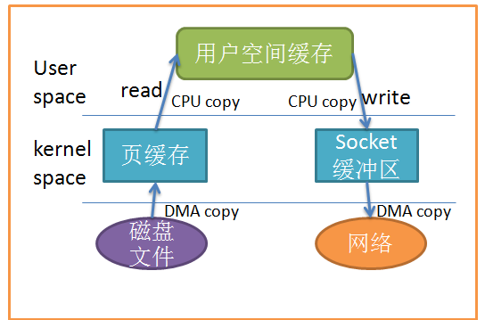
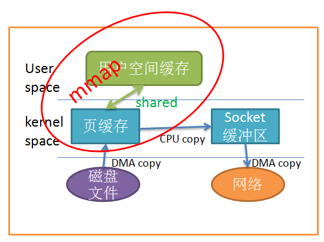
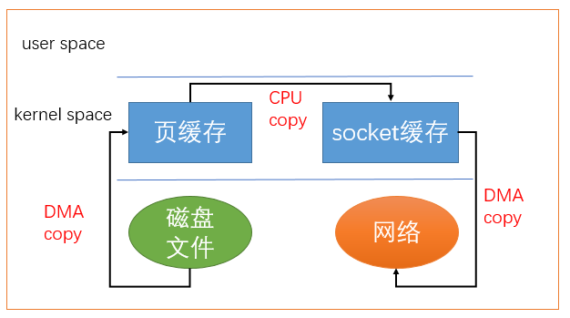
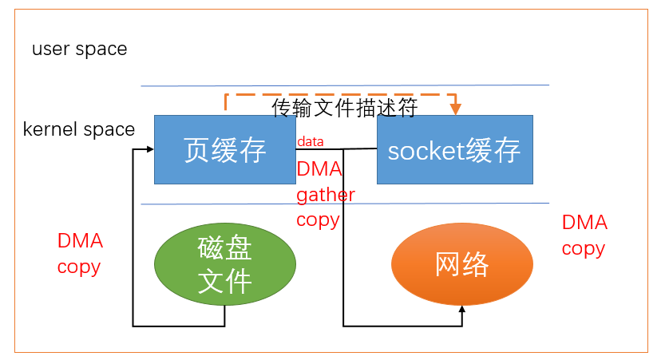

# Linux 中的零拷贝技术

## 什么是拷贝

要知道零拷贝，需要先知道什么是拷贝。其实这个”拷贝“来自于 Linux 中的标准 I/O 接口的基本数据拷贝的操作，而这一操作会导致数据在操作系统内核地址空间的缓冲区和应用程序地址空间定义的缓冲区之间进行传输。

## 为什么需要零拷贝

从上图中可以看出，共产生了四次数据拷贝，即使使用了DMA来处理了与硬件的通讯，CPU仍然需要处理两次数据拷贝，与此同时，在用户态与内核态也发生了多次上下文切换，无疑也加重了CPU负担。

在此过程中，我们没有对文件内容做任何修改，那么在内核空间和用户空间来回拷贝数据无疑就是一种浪费，而零拷贝主要就是为了解决这种低效性。

概括来说，原因为以下两点：

1. 占用了较多的 CPU 时间；
2. 占用了较多的内存空间。

## 如何来改进

既然传统的 I/O 操作有性能问题，那么如何改进呢？我们将其定义为“**零拷贝技术**”。

事实上零拷贝主要指的是**避免数据拷贝，而非没有拷贝**。大致概括如下：

- 避免操作系统内核缓冲区之间进行数据拷贝操作。
- 避免操作系统内核和用户应用程序地址空间这两者之间进行数据拷贝操作。
- 用户应用程序可以避开操作系统直接访问硬件存储。
- 数据传输尽量让 DMA 来做。
- 避免不必要的系统调用和上下文切换。
- 需要拷贝的数据可以先被缓存起来。
- 对数据进行处理尽量让硬件来做。

## 零拷贝技术分类

### 直接 I/O

应用程序直接访问硬件存储，操作系统内核只是辅助数据传输。

### 避免内核地址空间的缓冲区和用户应用程序地址空间的缓冲区之间的拷贝

#### mmap()

应用程序调用了 mmap() 之后，数据会先通过 DMA 拷贝到操作系统内核的缓冲区中去。接着，应用程序跟操作系统共享这个缓冲区，这样，操作系统内核和应用程序存储空间就不需要再进行任何的数据拷贝操作。

### sendfile()

利用 DMA 引擎将文件中的数据拷贝到操作系统内核缓冲区中，然后数据被拷贝到与 socket 相关的内核缓冲区中去。接下来，DMA 引擎将数据从内核 socket 缓冲区中拷贝到协议引擎中去。

这里还是有一次 CPU 拷贝，怎么把这个也省掉呢？继续看——

### 带有 DMA 收集拷贝功能的 sendfile()

之前我们是把页缓存的数据拷贝到socket缓存中，实际上，我们仅仅需要把缓冲区描述符传到 socket 缓冲区，再把数据长度传过去，这样 DMA 控制器直接将页缓存中的数据打包发送到网络中就可以了。

上图总结为以下 3 步：

1. DMA 从拷贝至内核缓冲区
2. 将数据的位置和长度的信息的描述符增加至内核空间（socket 缓冲区）
3. DMA 将数据从内核拷贝至协议引擎

### splice()

sendfile 利用了Linux提出的管道缓冲区机制，只适用于将数据从文件拷贝到套接字上，有一方必须是管道设备，因而限定了它的使用范围。

## 对数据在页缓存和用户进程的缓冲区的传输过程进行优化

以上几种零拷贝技术都是减少数据在用户空间和内核空间拷贝技术实现的，但是有些时候，数据必须在用户空间和内核空间之间拷贝。这时候，我们只能针对数据在用户空间和内核空间拷贝的时机上下功夫了。

一般方法有：

1. 写时复制

2. 缓冲区共享

这里不再细说，感兴趣的可以阅读后面的参考文章深入了解。

## 小结

在实际应用中，尽管 sendfile  有一些缺点（比如缺少标准实现等），但依然是一个非常有用的功能。Kafka 的消息消费机制就是使用 sendfile —— 严格来说是通过 Java 的 `FileChannel.transferTo` 方法来实现的。

## 参考文章

1. [Linux 中的零拷贝技术，第 1 部分](https://www.ibm.com/developerworks/cn/linux/l-cn-zerocopy1/index.html)
2. [Linux 中的零拷贝技术，第 2 部分](https://www.ibm.com/developerworks/cn/linux/l-cn-zerocopy2/index.html)
3. [浅析Linux中的零拷贝技术](https://www.jianshu.com/p/fad3339e3448)