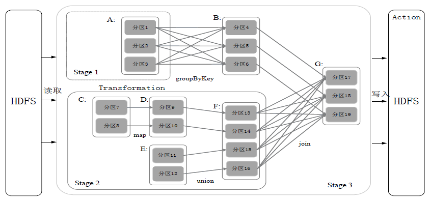

# Spark 常见问题

#### RDD 是什么？

一个只读的，可分区的分布式数据集，这个数据集的全部或部分可以缓存在内存中，在多次计算间重用。

#### RDD 的数据结构？

1. 一个分区列表，每个分区里是RDD的部分数据（或称数据块）。
2. 一个依赖列表，存储依赖的其他RDD。
3. 一个名为 `compute` 的计算函数，用于计算 RDD 各分区的值。
4. 分区器（可选），用于键/值类型的 RDD，比如某个 RDD 是按散列来分区。
5. 计算各分区时优先的位置列表（可选），比如从 HDFS 上的文件生成 RDD 时，RDD分区的位置优先选择数据所在的节点，这样可以避免数据移动带来的开销。

#### RDD 的特点有哪些？

1. 只读：状态不可变，不能修改。
2. 分区：支持使 RDD 中的元素根据那个 key 来分区（partitioning），保存到多个结点上。还原时只会重新计算丢失分区的数据，而不会影响整个系统。
3. 路径：在 RDD 中叫血缘（lineage），即 RDD 有充足的信息关于它是如何从其他 RDD 产生而来的。
4. 持久化：支持将会被重用的 RDD 缓存（如 in-memory 或溢出到磁盘）。
5. 延迟计算： Spark 也会延迟计算 RDD ，使其能够将转换管道化（pipeline transformation）。
6. 操作：丰富的转换（transformation）和动作（action）， count/reduce/collect/save 等。

#### RDD 底层实现原理


每个 RDD 的数据都以 Block 的形式存储于多台机器上，上图是 Spark 的 RDD 存储架构图，其中每个 Executor 会启动一个 BlockManagerSlave，并管理一部分 Block；而 Block 的元数据由 Driver 节点的 BlockManagerMaster保存。BlockManagerSlave 生成 Block 后向 BlockManagerMaster 注册该 Block， BlockManagerMaster 管理 RDD 与 Block 的关系，当 RDD 不再需要存储的时候，将向 BlockManagerSlave 发送指令删除相应的 Block。

#### Spark DAG 是什么？


这个 DAG 中的点就是 RDD 或者 stage，边就是各种算子。

#### 什么是宽依赖和窄依赖？

窄依赖指的是一个父 RDD 的分区至多被一个子 RDD 的分区使用，如 map、filter 等算子；

宽依赖指的是一个父 RDD 的分区被多个子 RDD 的分区使用，如 join、reduceByKey 等算子。

#### RDD 的血缘机制？

每个 RDD 除了包含**分区信息**外，还包含它**从父辈 RDD 变换过来的步骤**，以及**如何重建某一块数据的信息**，因此 RDD 的这种容错机制又称“血统”（**Lineage**）容错。Lineage 本质上很类似于数据库中的重做日志（Redo Log），只不过这个重做日志粒度很大，是对全局数据做同样的重做以便恢复数据。

相比其他系统的细颗粒度的内存数据更新级别的备份或者 LOG 机制，RDD 的 Lineage 记录的是粗颗粒度的特定数据 Transformation 操作（如 filter、map、join 等）。当这个 RDD 的部分分区数据丢失时，它可以通过 Lineage获取足够的信息来重新计算和恢复丢失的数据分区。但这种数据模型粒度较粗，因此限制了 Spark 的应用场景。所以可以说 Spark 并不适用于所有高性能要求的场景，但同时相比细颗粒度的数据模型，也带来了性能方面的提升。

#### Spark 的容错机制

一般而言，对于分布式系统，数据集的容错性通常有两种方式：

1. 数据检查点（在 Spark 中对应 Checkpoint 机制）。
2. 记录数据的更新（在 Spark 中对应 Lineage 血缘机制）。

对于大数据而言，数据检查点操作（一般是将 RDD 写入持久化存储，如 HDFS）成本较高，可能涉及大量的数据复制操作，消耗 I/O 资源。而通过血统机制则不需要存储正在的数据，容错的成本比较低。但是问题在于如果血缘很长（即依赖的关联链路很长），如果失败重算，那代价也是很高的，所以 Spark 提供了 Checkpoint 的 API，将恢复代价更小的选择交给用户，进一步控制容错的时间。

通常在含有宽依赖的容错中，使用 Checkpoint 机制设置检查点，这样就不至于重新计算父 RDD 而产生冗余计算了（具体可以参考上面“宽依赖”的定义）。

#### Spark的集群架构


- SparkContext 负责与 ClusterManager 通信，进行资源的申请、任务的分配和监控等，并负责作业执行的全生命周期管理。
- ClusterManager 提供了资源的分配和管理，目前支持 Standalone、Apache Mesos、Hadoop Yarn 。
- 当 SparkContext 对运行的作业划分并分配资源后，会把任务发送 Executor 来运行。每个 Executor 是独立的进程，并以多线程方式运行 Task 。

#### Spark 的资源调度与作业调度？


1. 首先为应用构建起基本的运行环境，即由 Driver 创建一个 SparkContext，进行资源的申请、任务的分配和监控。
2. 资源管理器为 Executor 分配资源，并启动 Executor 进程。
3. SparkContext 根据 RDD 的依赖关系构建 DAG 图，DAG 图提交给 DAGScheduler 解析成 Stage，然后把一个个 TaskSet 提交给底层调度器 TaskScheduler 处理；Executor 向 SparkContext 申请 Task，Task Scheduler将 Task 发放给 Executor运行，并提供应用程序代码。
4. Task 在 Executor 上运行，把执行结果反馈给 TaskScheduler，然后反馈给 DAGScheduler，运行完毕后写入数据并释放所有资源。

#### Stage 是如何划分的？

Spark 通过分析各个 RDD 的依赖关系生成 DAG，再通过分析各个 RDD 中的分区之间的依赖关系来决定如何划分 Stage，具体划分方法是：

1. 在 DAG 中进行反向解析，遇到宽依赖就断开
2. 遇到窄依赖就把当前的 RDD 加入到 Stage 中
3. 将窄依赖尽量划分在同一个 Stage 中，可以实现流水线计算



如上图，被分成三个 Stage，在 Stage2 中，从 map 到 union 都是窄依赖，这两步操作可以形成一个流水线操作。分区7通过 map 操作生成的分区9，可以不用等待分区8到分区10这个 map 操作的计算结束，而是继续进行union 操作，得到分区13，这样流水线执行大大提高了计算的效率。

Stage 的类型包括两种：

1. **ShuffleMapStage**

   不是最终的 Stage，在它之后还有其他 Stage，所以，它的输出一定需要经过 Shuffle 过程，并作为后续 Stage 的输入；这种 Stage 是以 Shuffle 为输出边界，其输入边界可以是从外部获取数据，也可以是另一个 ShuffleMapStage 的输出，其输出可以是另一个 Stage 的开始；在一个 Job 里可能有该类型的 Stage，也可能没有该类型 Stage；

2. **ResultStage**

   最终的 Stage，没有输出，而是直接产生结果或存储。这种 Stage 是直接输出结果，其输入边界可以是从外部获取数据，也可以是另一个 ShuffleMapStage 的输出。在一个 Job 里必定有该类型 Stage。因此，一个 Job 含有一个或多个 Stage，其中至少含有一个 ResultStage。

#### Spark 的资源调度粒度？

|      | 粗粒度                                                       | 细粒度                                                       |
| ---- | ------------------------------------------------------------ | ------------------------------------------------------------ |
| 定义 | 在 Application 执行之前，将所有的资源申请完毕，当资源申请成功后才会进行任务的调度，当所有的 Task 执行完毕后，才会释放这部分资源。 | 在 Application 执行之前,不需要先去申请资源，直接执行，让里面的每一个task自己去申请，申请到了资源，Task就执行，执行完毕就释放资源。 |
| 优点 | 在 Application 执行之前，资源全部申请好，每个Task直接使用资源就好了，不需要 Task 自己去申请资源，Task 的启动变快，Stage 计算变快，Job 计算变快，Application 计算变快。 | 申请完资源，执行完就释放，资源能够充分的使用。               |
| 缺点 | 直到最后一个 Task 执行完后才释放资源，集群的资源无法充分的利用。 | Task 启动慢，Application 执行就慢。                          |

注意：Yarn 上粗粒度的资源申请和细粒度的资源申请，针对的是实现 ApplicationMaster 的方式是粗粒度的还是细粒度来定义的。Spark 在 Yarn 上实现的 ApplicationMaster 是**以粗粒度的方式实现**的，而 MapReduce 在 Yarn 上实现的 ApplicationMaster 是以细粒度的方式实现的。

#### Spark 中的 RPC 模块是用什么实现的？

在 Spark 2.0 之前，使用的是 Akka，在 2.0 以后底层通信调用 Netty，虽然剥离了Akka，但是还是沿袭了Actor模式中的一些概念。在现在的Spark RPC中有如下映射关系：

```
RpcEndpoint => Actor
RpcEndpointRef => ActorRef
RpcEnv => ActorSystem
```

#### Spark Standalone 运行模式

来自书

#### Spark Yarn-Client 运行模式

来自书

#### Spark Yarn-Cluster 运行模式

来自书

#### Spark Yarn-Cluster 和 Yarn-Client 模式的区别

Yarn-Cluster 和 Yarn-Client 模式的区别其实**就是 Application Master 进程的区别**，Yarn-Cluster 模式下，**Driver 运行在 AM（Application Master）中**，它负责向 YARN 申请资源，并监督作业的运行状况。当用户提交了作业之后，就可以关掉 Client，作业会继续在 YARN 上运行。**因而 Yarn-Cluster 模式不适合运行交互类型的作业**。在 Yarn-Client 模式下，Application Master 仅仅向 YARN 请求 Executor，而 **Driver 会在 Client 上启动**，Client 会和请求的 Container 通信来调度他们工作，也就是说 Client 不能离开。

#### 附：常见术语

- **Application:** Appliction 是指用户编写的 Spark 应用程序，其中包括一个 Driver 功能的代码和分布在集群中多个节点上运行的 Executor 代码。
- **Driver:**  Spark 中的 Driver 即运行上述 Application 的 main函数并创建 SparkContext，创建 SparkContext的目的是为了准备 Spark 应用程序的运行环境，在 Spark 中有 SparkContext 负责与 ClusterManager 通信， 进行资源申请、任务的分配和监控等，当 Executor 部分运行完毕后，Driver 同时负责将 SparkContext 关闭，通常用 SparkContext 代表 Driver。
- **Executor:**  某个 Application 运行在 worker 节点上的一个进程，  该进程负责运行某些 Task， 并且负责将数据存到内存或磁盘上，每个 Application 都有各自独立的一批 Executor， 在 Spark on Yarn 模式下，其进程名称为 CoarseGrainedExecutor Backend。一个 CoarseGrainedExecutor Backend 有且仅有一个 Executor对象， 负责将 Task 包装成 taskRunner，并从线程池中抽取一个空闲线程运行 Task， 这个每一个 CoarseGrainedExecutor Backend 能并行运行 Task 的数量取决与分配给它的 cpu 个数。
- **Cluter Manager：**指的是在集群上获取资源的外部服务，目前目前支持 Standalone、Apache Mesos、Hadoop Yarn 。


- **Worker:** 集群中任何可以运行 Application 代码的节点，在 Standalone 模式中指的是通过 slave 文件配置的Worker 节点，在 Spark on Yarn 模式下就是NoteManager节点。
- **Task:** 被送到某个 Executor 上的工作单元，但 hadoopMR 中的 Map Task 和 Reduce Task 概念一样，是运行 Application 的基本单位，多个 Task 组成一个 Stage，而 Task 的调度和管理等是由 TaskScheduler负责。
- **Job:** 包含多个 Task 组成的并行计算，往往由 Spark Action 触发生成， 一个 Application 中往往会产生多个 Job。
- **Stage:** 每个 Job 会被拆分成多组 Task， 作为一个 TaskSet， 其名称为 Stage，Stage 的划分和调度是有 DAGScheduler 来负责的，Stage 有非最终的 Stage（Shuffle Map Stage）和最终的 Stage（Result Stage）两种，Stage的边界就是发生 shuffle 的地方。

#### 参考文章

1. [Spark技术原理](https://cshihong.github.io/2018/05/25/Spark%E6%8A%80%E6%9C%AF%E5%8E%9F%E7%90%86/)

2. [Spark(一): 基本架构及原理](https://www.cnblogs.com/tgzhu/p/5818374.html)

3. [Cluster Mode Overview](http://spark.apache.org/docs/latest/cluster-overview.html)