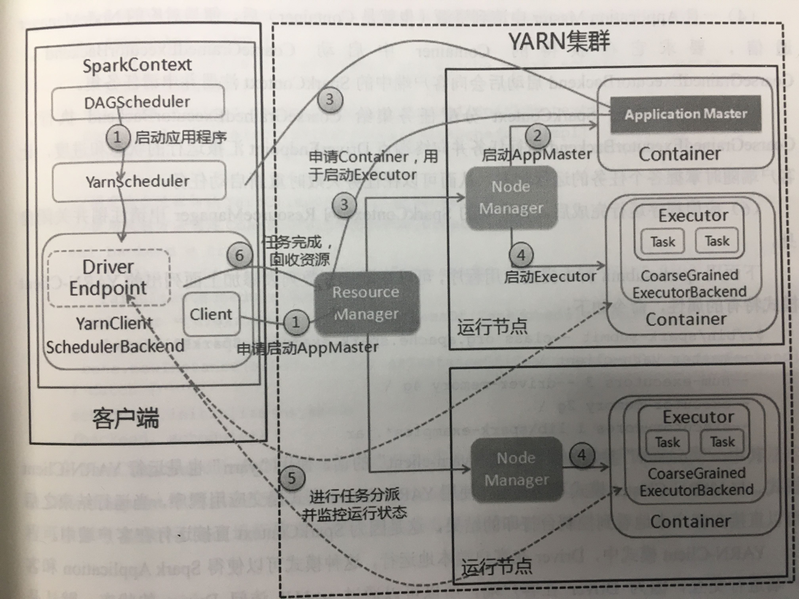
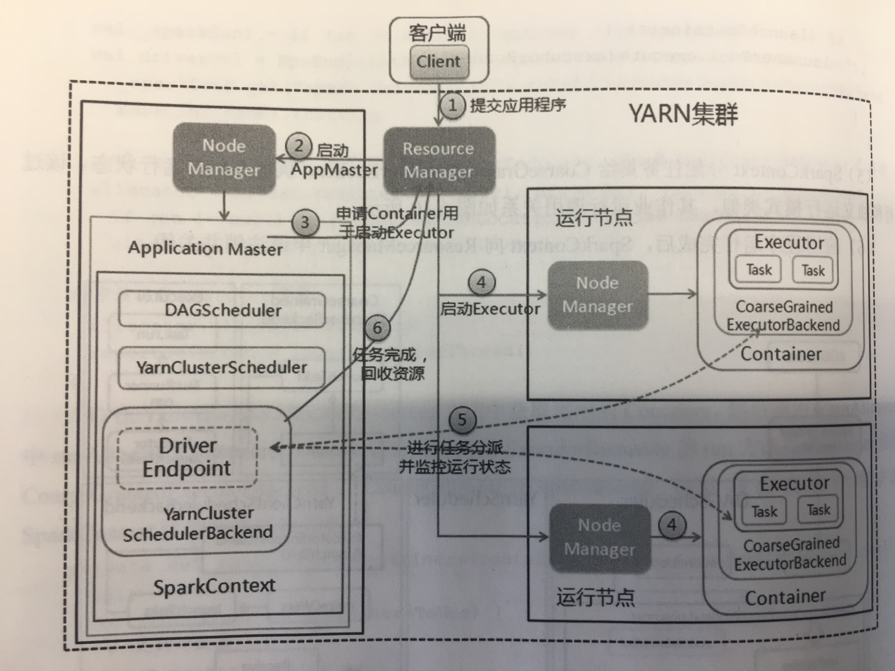

# Spark 运行模式

#### Spark Standalone 运行模式

1. 启动应用程序，在 SparkContext 启动过程中，先初始化 DAGScheduler 和 TaskSchedulerImpl 两个调度器，同时初始化 SparkDeploySchedulerBackend，并在其内部启动终端点 DriverEndpoint 和 ClientEndpoint。
2. 终端点 ClientEndpoint 向 Master 注册应用程序，Master 收到注册消息后把该应用加入到等待运行列表中，等待由 Master 分派给应用程序 Worker。
3. 当应用程序获取到 Worker 时，Master 会通知 Worker 中的终端点 WorderEndpoint 创建 CoarseGrainedExecutorBackend 进程，在该进程中创建执行容器 Executor。
4. Executor 创建完毕后发送消息给 Master 和终端点 DriverEndpoint，告知 Executor 已经创建完毕，在 SparkContext 成功注册后，等待接收从 Driver 终端点发送执行任务的消息。
5. SparkContext 分配任务集给 CoarseGrainedExecutorBackend 执行，任务执行是在 Executor 按照一定调度策略进行的。
6. CoarseGrainedExecutorBackend 在任务处理过程中，把处理任务的状态发送给 SparkContext 的终端点 DriverEndpoint，SparkContext 根据任务执行不同的结果进行处理。如果任务集处理完毕后，则会继续发送其他的任务集。
7. 应用程序运行完成后，SparkContext 会进行资源回收，先销毁在各 Worker 的 CoarseGrainedExecutorBackend 进程，然后注销自身。

**小结**：初始化 SparkContext -> 向 Master 注册并排队 -> 在 Worker 中创建 Executor 并注册到 Driver 中 -> Driver 发送任务到 Executor 中执行 -> Executor 执行任务并汇报给 Driver -> 回收 Executor 资源并关闭 SparkContext。

#### Spark Yarn-Client 运行模式

1. 启动应用程序，在 SparkContext 启动过程中，初始化 DAGScheduler 调度器，使用反射方法初始化 YarnScheduler 和 YarnClientSchedulerBackend。YarnClientSchedulerBackend 在内部启动终端点 DriverEndpoint 和 Client，然后 Client 向 Yarn 集群的 ResourceManager 申请启动 Application Master。
2. ResourceManager 收到请求后，在集群中选择一个 NodeManager，为该应用程序分配第一个 Container，要求在这个 Container 中启动应用程序的 Application Master。
3. Client 中的 SparkContext 启动完毕后，与 Application Master 建立通信，向 ResourceManager 注册，根据任务信息向 ResourceManager 申请资源（Container）。
4. 一旦 Application Master 申请到资源（也就是 Container）后，便与对应的 NodeManager 通信，要求它在获得的 Container 中启动 CoarseGrainedExecutorBackend，CoarseGrainedExecutorBackend 启动后会向客户端中的 SparkContext 注册并申请任务集。
5. 客户端中的 SparkContext 分配任务集给 CoarseGrainedExecutorBackend 执行，CoarseGrainedExecutorBackend 运行任务并向终端点 DriverEndpoint 汇报运行的状态和进度，让客户端随时掌握各个任务的运行状态，从而可以在任务失败时重新启动任务。
6. 应用程序运行完成后，客户端的 SparkContext 向 ResourceManager 申请注销并关闭自身。

**小结**：SparkContext 在客户端启动 -> 向 Yarn 的 ResourceManger 申请启动 Application Master -> ResourceManger 选择一个 NodeManger 并分配第一个 Container 来启动 Application Master -> Application Master 向 ResourceManager 申请 Container 并启动 Executor -> Executor 执行任务并汇报给 Driver -> SparkContext 向 ResourceManager 申请注销并关闭自身

#### Spark Yarn-Cluster 运行模式

1. 客户端提交应用程序时，启动 Client  向 Yarn 中提交应用程序，包括启动 Application Master 的命令、提交给 Application Master 的程序和需要在 Executor 中运行的程序等。
2. ResourceManager 收到请求后，在及群众选择一个 NodeManager，为该应用程序分配第一个 Container，要求它在这个 Container 中启动应用程序的 Application Master ，其中 Application Master  进行 SparkContext 等的初始化。
3. Application Master 向 ResourceManager 注册，这样用户可以直接通过 ResourceManager 查看应用程序的运行状态，然后它将采用轮询的方式为各个任务申请资源，并监控它们的运行状态直到运行结束。
4. 一旦 Application Master 申请到资源（也就是 Container）后，便与对应的 NodeManager 通信，要求它在获得的 Container 中启动 CoarseGrainedExecutorBackend，CoarseGrainedExecutorBackend 启动后会向 Application Master 中的 SparkContext 注册并申请任务集。
5. Application Master 中的 SparkContext 分配任务集给 CoarseGrainedExecutorBackend 执行，CoarseGrainedExecutorBackend 运行任务并向 Application Master 汇报运行的状态和进度，以让 Application Master 随时掌握各个任务的运行状态，从而可以在任务失败时重新启动任务。
6. 应用程序运行完成后，Application Master 向 ResourceManager 申请注销并关闭。

**小结**：提交应用程序 -> ResourceManager 收到请求后选择一个 NodeManager 并分配第一个 Container 用于启动 Application Master，并在其中初始化 SparkContext -> Application Master 向 ResourceManager 申请 Container 并启动 Executor -> Executor 执行任务并汇报给 Driver -> SparkContext 向 ResourceManager 申请注销并关闭自身

#### 参考文章

1. 郭景瞻的《图解 Spark: 核心技术与案例实战》