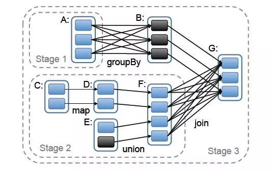
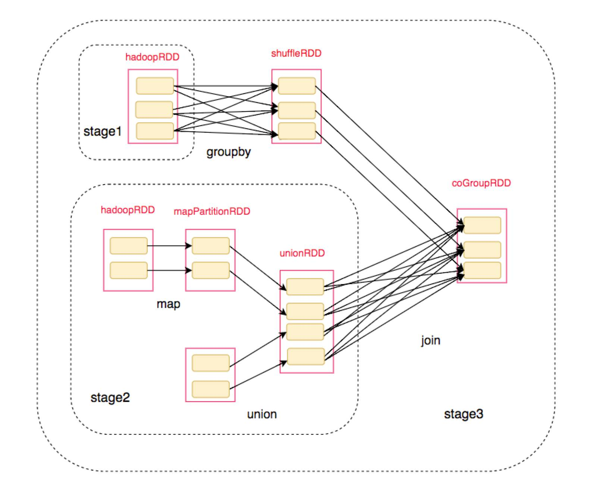
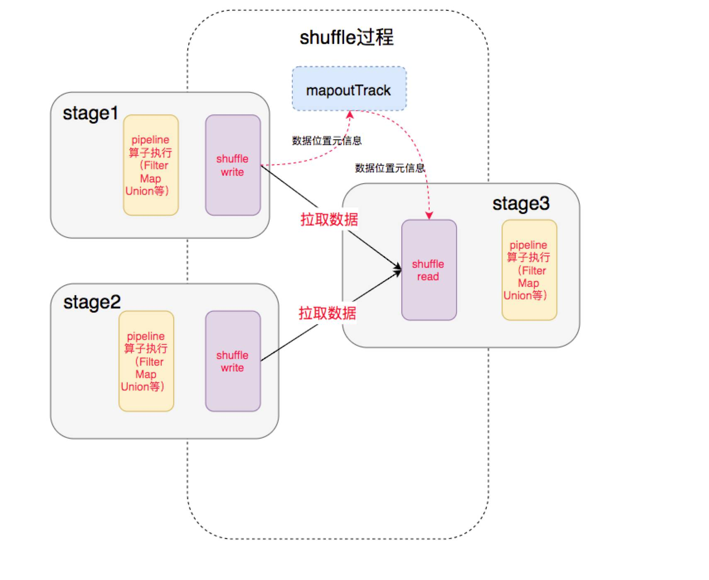
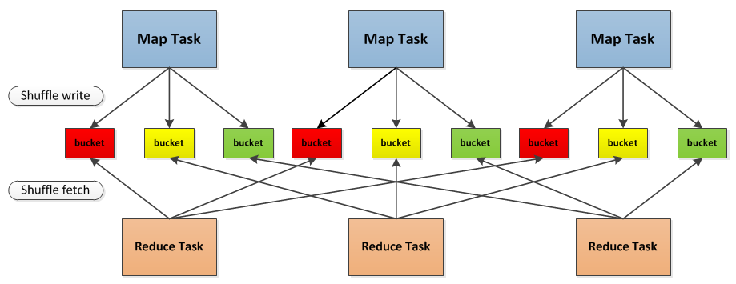
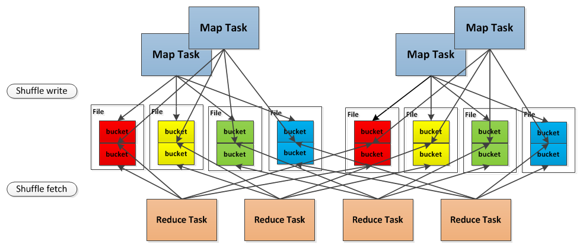

# Spark Shuffle 详解

## 定义

有些运算需要将各节点上的同一类数据汇集到某一节点进行计算，把这些分布在不同节点的数据按照一定的规则汇集到一起的过程称为 Shuffle。

下面用一组图例说明什么时候需要 Shuffle ——

下图是 Spark Job 的依赖图：



将对应的 RDD 标注上去后：



对于这一过程，我们分析其中的 Shuffle：



这其中就涉及到 Shuffle 过程，前一个 Stage 的 ShuffleMapTask 进行 Shuffle Write， 把数据存储在 BlockManager 上面， 并且把数据位置元信息上报到 Driver 的 MapOutTrack 组件中， 下一个 Stage 根据数据位置元信息， 进行 Shuffle Read， 拉取上个 Stage 的输出数据。

在介绍 Spark 的 Shuffle 之前，我们先提下 Hadoop 中的 Shuffle 吧。

## MapReduce 中的 Shuffle

说起 Shuffle，就不能不提 Hadoop，在 MapReduce 框架中，Shuffle 是来连接 Map 和 Reduce 的桥梁，Map 的输出要用到 Reduce 中必须经过 Shuffle 环节。由于 Shuffle 阶段涉及磁盘的读写和网络传输，因此 Shuffle 的性能直接影响整个程序的性能和吞吐量。

下图描述了 MapReduce 的整个流程，其中 Shuffle 是介于 Map 和 Reduce 之间。


上面我们提到 Shuffle 分为 Shuffle Write 和 Shuffle Read，下面我们就针对 Spark 中的情况逐一讲解。

**注： 由于后续的 Spark Shuffle 示例都是以 MapReduce Shuffle 为参考的，所以下面提到的 Map Task 指的就是 Shuffle Write 阶段，Reduce Task 指的就是 Shuffle Read 阶段。**

## Shuffle 技术演进

### Hash Shuffle V1

相对于传统的 MapReduce，Spark 假定大多数情况下 Shuffle 的数据不需要排序，例如 Word Count，强制排序反而会降低性能。因此不在 Shuffle Read 时做 Merge Sort，如果需要合并的操作的话，则会使用聚合（agggregator），即用了一个 HashMap （实际上是一个 AppendOnlyMap）来将数据进行合并。

在 Map Task 过程按照 Hash 的方式重组 Partition 的数据，不进行排序。每个 Map Task 为每个 Reduce Task 生成一个文件，通常会产生大量的文件（即对应为 M*R 个中间文件，其中 M 表示 Map Task 个数，R 表示 Reduce Task 个数），伴随大量的随机磁盘 I/O 操作与大量的内存开销。



总结下这里的两个严重问题：

1. 生成大量文件，占用文件描述符，同时引入 DiskObjectWriter 带来的 Writer Handler 的缓存也非常消耗内存；
2. 如果在 Reduce Task 时需要合并操作的话，会把数据放在一个 HashMap 中进行合并，如果数据量较大，很容易引发 OOM。

### Hash Shuffle V2

**针对上面的第一个问题**，Spark 做了改进，引入了 **File Consolidation** 机制。

一个 Executor 上所有的 Map Task 生成的分区文件只有一份，即将所有的 Map Task 相同的分区文件合并，这样每个 Executor 上最多只生成 N 个分区文件。



这样就减少了文件数，但是假如下游 Stage 的分区数 N 很大，还是会在每个 Executor 上生成 N 个文件，同样，如果一个 Executor 上有 K 个 Core，还是会开 K*N 个 Writer Handler，所以这里仍然容易导致OOM。

### Sort Shuffle V1

为了更好地解决上面的问题，Spark 参考了 MapReduce 中 Shuffle 的处理方式，引入基于排序的 Shuffle 写操作机制。

每个 Task 不会为后续的每个 Task 创建单独的文件，而是**将所有对结果写入同一个文件**。该文件中的记录首先是按照 Partition Id 排序，每个 Partition 内部再按照 Key 进行排序，Map Task 运行期间会顺序写每个 Partition 的数据，**同时生成一个索引文件**记录每个 Partition 的大小和偏移量。

在 Reduce 阶段，Reduce Task 拉取数据做 Combine 时不再是采用 HashMap，而是采用ExternalAppendOnlyMap，该数据结构在做 Combine 时，如果内存不足，会刷写磁盘，很大程度的保证了鲁棒性，避免大数据情况下的 OOM。

总体上看来 **Sort Shuffle 解决了 Hash Shuffle 的所有弊端**，但是因为需要其 Shuffle 过程需要对记录进行排序，所以**在性能上有所损失**。

### Tungsten-Sort Based Shuffle / Unsafe Shuffle

从 Spark 1.5.0 开始，Spark 开始了钨丝计划（Tungsten），目的是优化内存和CPU的使用，进一步提升spark的性能。由于使用了堆外内存，而它基于 JDK Sun Unsafe API，故 Tungsten-Sort Based Shuffle 也被称为 Unsafe Shuffle。

它的做法是将数据记录用**二进制的方式存储**，直接**在序列化的二进制数据上 Sort** 而不是在 Java 对象上，这样一方面可以减少内存的使用和 GC 的开销，另一方面避免 Shuffle 过程中频繁的序列化以及反序列化。在排序过程中，它**提供 cache-efficient sorter**，使用一个 8 bytes 的指针，**把排序转化成了一个指针数组的排序，极大的优化了排序性能**。

但是使用 Tungsten-Sort Based Shuffle 有几个限制，Shuffle 阶段不能有 aggregate 操作，分区数不能超过一定大小（2^24-1，这是可编码的最大 Parition Id），所以像 reduceByKey 这类有 aggregate 操作的算子是不能使用 Tungsten-Sort Based Shuffle，它会退化采用 Sort Shuffle。

### Sort Shuffle v2

从 Spark-1.6.0 开始，把 Sort Shuffle 和 Tungsten-Sort Based Shuffle 全部统一到 Sort Shuffle 中，如果检测到满足 Tungsten-Sort Based Shuffle 条件会自动采用 Tungsten-Sort Based Shuffle，否则采用 Sort Shuffle。从Spark-2.0.0开始，Spark 把 Hash Shuffle 移除，可以说目前 Spark-2.0 中只有一种 Shuffle，即为 Sort Shuffle。

## Shuffle Read

关于 Shuffle Read，主要了解以下问题：

1. **在什么时候获取数据**，Parent Stage 中的一个 ShuffleMapTask 执行完还是等全部 ShuffleMapTasks 执行完？

   当 Parent Stage 的所有 ShuffleMapTasks 结束后再 fetch。

2. **边获取边处理还是一次性获取完再处理？**

   因为 Spark 不要求 Shuffle 后的数据全局有序，因此没必要等到全部数据 shuffle 完成后再处理，所以是边 fetch 边处理。

3. 获取来的**数据存放到哪里**？

   刚获取来的 FileSegment 存放在 softBuffer 缓冲区，经过处理后的数据放在内存 + 磁盘上。

   内存使用的是AppendOnlyMap ，类似 Java 的HashMap，内存＋磁盘使用的是ExternalAppendOnlyMap，如果内存空间不足时，ExternalAppendOnlyMap可以将 records 进行 sort 后 spill（溢出）到磁盘上，等到需要它们的时候再进行归并


4. 怎么获得**数据的存放位置**？

   通过请求 Driver 端的 MapOutputTrackerMaster 询问 ShuffleMapTask 输出的数据位置。

## 触发 Shuffle 的操作

| 分类            | 操作                                                    |
| --------------- | ------------------------------------------------------- |
| repartition相关 | repartition、coalesce                                   |
| *ByKey操作      | groupByKey、reduceByKey、combineByKey、aggregateByKey等 |
| join相关        | cogroup、join                                           |

## Spark Shuffle 历史节点

- Spark 0.8 及以前 Hash Based Shuffle
- Spark 0.8.1 为 Hash Based Shuffle引入File Consolidation机制
- Spark 0.9 引入 ExternalAppendOnlyMap
- Spark 1.1 引入 Sort Based Shuffle，但默认仍为 Hash Based Shuffle
- Spark 1.2 默认的 Shuffle 方式改为 Sort Based Shuffle
- Spark 1.4 引入 Tungsten-Sort Based Shuffle
- Spark 1.6 Tungsten-Sort Based Shuffle 并入 Sort Based Shuffle
- Spark 2.0 Hash Based Shuffle 退出历史舞台

## Spark Shuffle 相关调优

从上述 Shuffle 的原理介绍可以知道，Shuffle 是一个涉及到 CPU（序列化反序列化）、网络 I/O（跨节点数据传输）以及磁盘 I/O（shuffle中间结果落地）的操作，用户在编写 Spark 应用程序的时候应当尽可能考虑 Shuffle 相关的优化，提升 Spark应用程序的性能。下面简单列举几点关于 Spark Shuffle 调优的参考。

- 尽量减少 Shuffle次数

```
// 两次shuffle
rdd.map(...).repartition(1000).reduceByKey(_ + _, 3000)

// 一次shuffle
rdd.map(...).repartition(3000).reduceByKey(_ + _)
```

- 必要时主动 Shuffle，通常用于改变并行度，提高后续分布式运行速度

```
rdd.repartiton(largerNumPartition).map(...)...
```

- 使用 treeReduce & treeAggregate 替换 reduce & aggregate。数据量较大时，reduce & aggregate 一次性聚合，Shuffle 量太大，而 treeReduce & treeAggregate 是分批聚合，更为保险。

## 参考文章

1. [彻底搞懂 Spark 的 shuffle 过程（shuffle write）](https://toutiao.io/posts/eicdjo/preview)
2. [Spark Shuffle工作原理详解](http://lionheartwang.github.io/blog/2018/03/11/spark-shuffle-implementation/)
3. [Spark Shuffle的技术演进](https://www.jianshu.com/p/4c5c2e535da5)
4. [Spark Shuffle原理及相关调优](http://sharkdtu.com/posts/spark-shuffle.html)
5. [详细探究Spark的shuffle实现](http://jerryshao.me/2014/01/04/spark-shuffle-detail-investigation/)

