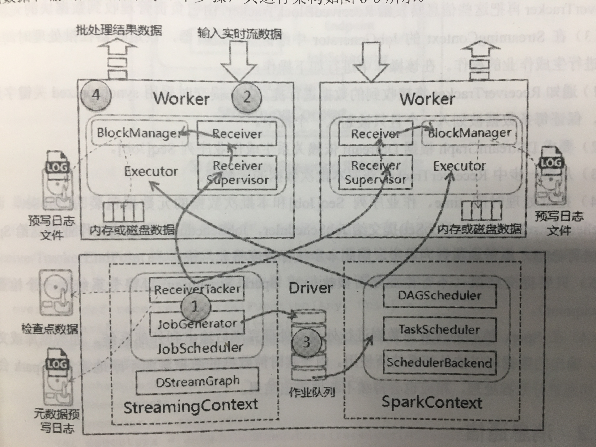

# Spark Streaming 常见问题

#### 1. Spark Streaming 基本原理

Spark Streaming 接收实时的数据流，并将数据切分为一个个的 batch，通过 Spark Engine 的处理，最终产生结果数据。

Spark Streaming 提供了一个高层抽象，称为 discretized stream 或 DStream，它表示连续的数据流。DStream 可以通过 Kafka、Flume 和 Kinesis 等来源的输入数据流创建，也可以由其他 DStream 创建。在内部实现上，DStream 表示为一组连续的 RDD。

#### 2. Spark Streaming 运行架构

大致分为 4 个阶段：

1. 启动流处理引擎
2. 接收及存储流数据
3. 处理流数据
4. 输出处理结果

具体如下：

1. 初始化 StreamingContext 对象，在该对象启动过程中实例化 DStreamGraph 和 JobScheduler，其中 DStreamGraph 用于存放 DStream 以及 DStream 之间的依赖关系等信息，而 JobScheduler 中包括 ReceiveTracker 和 JobGenerator。其中 ReceiverTracker 为 Driver 端流数据接收器（Receiver）的管理者，JobGenerator 为批处理作业生成器。在 ReceiverTracker 启动过程中，根据流数据接收器分发策略通知对应的 Executor 中的流数据接收管理器（ReceiverSupervisor）启动，再由 ReceiverSupervisor 启动流数据接收器。
2. 当流数据接收器 Receiver 启动后，持续不断地接收实时流数据，根据传过来数据的大小进行判断，如果数据流很小，则攒多条数据成一块，然后在进行**块存储**；如果数据量大，则直接进行块存储。对于这些数据 Receiver 直接交给 **ReceiverSupervisor**，由其进行**数据转储**操作。块存储根据设置**是否预写日志**分为两种，一种是使用非预写日志 BlockManagerBasedBlockHandler 方法直接写到 Worker 的内存或磁盘中，另一种是进行预写日志 WriteAheadLogBasedBlockHandler 方法，即在预写日志同时把数据写入到 Worker 的内存或磁盘中。数据存储完毕后， ReceiverSupervisor 会把数据存储的元信息上报给 ReceiverTracker，ReceiverTracker 再把这些信息转发给 ReceivedBlockTracker，由它负责管理收到数据块的原信息。
3. 在 StreamingContext 的 JobGenerator 中维护一个定时器，该定时器在批处理时间到来时会进行生成作业的操作。
4. 在 Spark 核心的作业对数据进行处理，处理完毕后输出到外部系统，如数据库或文件系统，输出的数据可以被外部系统所使用。由于实时流数据的数据源源不断地流入，Spark 会周而复始地进行数据处理，相应也会持续不断地输出结果。

#### 参考文章

1. 郭景瞻的《图解 Spark: 核心技术与案例实战》