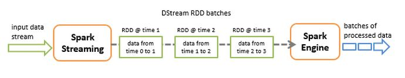

#### Spark Streaming 基本原理

Spark Streaming 接收实时的数据流，并将数据切分为一个个的 batch，通过 Spark Engine 的处理，最终产生结果数据。

Spark Streaming 提供了一个高层抽象，称为 discretized stream 或 DStream，它表示连续的数据流。DStream 可以通过 Kafka、Flume 和 Kinesis 等来源的输入数据流创建，也可以由其他 DStream 创建。在内部实现上，DStream 表示为一组连续的 RDD。

#### Spark Streaming 运行架构

来自书

#### 容错

