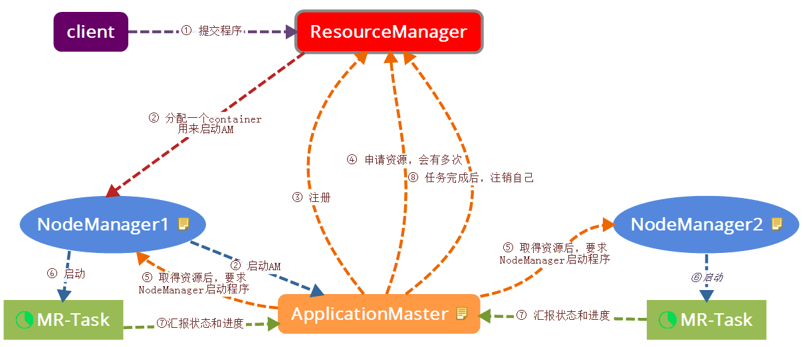

# Yarn 常见问题

#### 1. ResourceManager HA 方案

**架构图**

和之前介绍过的 [HDFS NameNode 高可用实现](../hdfs/ha.md)类似，Yarn 的 ResourceManager HA 采用的也是基于共享内存的主备方案，只不过 Yarn 的共享内存是 Zookeeper。由于 ResourceManager 不会保存已经分配的 ApplicationMaster 的资源信息和每个 NodeManager 的资源使用情况，所以它的 HA 实现是比较轻量级的。

**与 NameNode HA 的区别**

1. NN HA 中，DN 会同时向 Active NN 和 Standby NN 发送心跳；RM HA 中，NM 只会向 Active RM 发送心跳。
2. RM HA 的选举机制内建在 RM 里（EmbeddedElectorService类），而 NN HA 是用单独的 zkfc 进程进行选举的。

#### 2. Yarn 提交任务执行流程

1. 用户向 Yarn 提交程序，ResourceManager 接收到客户端请求

2. ResourceManager 分配第一个 Container，并选择一个 NodeManager，要求它在这个 Container 下启动 ApplicationMaster

3. ApplicationMaster 启动后，向 ResourceManager 发起注册请求

4. ApplicationMaster 向 ResourceManager申请资源

5. 取得资源后，根据资源，向相关的 NodeManager 通信，要求其启动程序

6. NodeManager（多个）启动任务

7. NodeManager 不断汇报任务状态和进展给 ApplicationMaster

8. 当任务全部完成时，ApplicationMaster 向 ResourceManager 汇报任务完成，并注销自己

#### 3. Yarn 的资源隔离方式？

* 对于内存，可以采用进程监控或者 Cgroups 的方案。
* 对于 CPU，采用 Cgroups 方案。

#### 4. 如何支持多用户的资源调度？

1. 在一个物理集群上虚拟多个 Hadoop 集群

   这些集群各自拥有全套独立的 Hadoop 服务，典型代表是 HOD 调度器（仅在 Hadoop 1.0 中提供，Haddop 2.0 开始不再包含）。

2. 扩展 Hadoop 调度器，支持多个队列多个用户

   可以允许管理员按照需求对用户或者应用程序进行分组，并为不同的分组分配不同的资源量，同时通过添加各种约束来防止单个用户或应用程序独占资源。

Hadoop 2.0 之后 Yarn 采用的就是**多队列方式**。

#### 5. 资源保证机制？

1. 增量资源分配

   当应用程序申请的资源暂时无法保证时，**优先为其预留**一个节点上的资源直到累积释放的空闲资源满足需求为止。

2. 一次性资源分配

   当应用程序申请的资源暂时无法保证时，**暂时放弃**当前资源直到出现一个节点的剩余资源能够一次性满足需求为止。

前者会造成资源浪费，后者会产生饿死现象即可能一直等下去，**Yarn 采用的是增量资源分配机制**。

#### 6. 什么时候会发生资源抢占？

每个队列会设置最小资源量和最大资源量，**为了提高资源利用率**资源调度器会将负载比较轻的队列 A 的资源暂时分配给负载中的队列 B，这个时候 A 的**最小资源量可能没有满足**，如果此时 A 突然收到新提交的应用需求申请资源时，可能就需要从 B 中抢回属于 A 的那部分资源。

#### 7. 资源调度器的分类？

资源调度器关注的是如何将节点上空闲的资源分配给应用程序。

**FIFO**

hadoop 1.x 使用的默认调度器就是 FIFO，FIFO采用队列方式将一个一个job任务按照时间先后顺序进行服务。

**Capacity Scheduler**

hadoop 2.x 使用的默认调度器是 Capacity Scheduler，主要特点是可以为每个队列设置资源最低保证和资源使用上限，而所有提交到该队列的应用程序共享这些资源。

**Fair Scheduler**

Facebook 开发的，主要特点是可以为每个队列单独设置调度策略（当前支持 FIFO、Fair、DRF 三个策略）

**Capacity Scheduler 和 Fair Scheduler 的区别**（来自董西成《Hadoop技术内幕》）

|                          | Capacity Scheduler                                           | Fair Scheduler                                               |
| ------------------------ | ------------------------------------------------------------ | ------------------------------------------------------------ |
| 目标                     | 提供一种多用户共享 Hadoop 集群的方法，以提高资源利用率和减小集群管理成本 | 同前者                                                       |
| 设计思想                 | 资源按比例分配给各个队列，并添加各种严格的限制防止个别用户或者队列独占资源 | 基于最大最小公平算法将资源分配给各个资源池或者用户           |
| 是否支持动态加载配置文件 | 是                                                           | 是                                                           |
| 是否支持负载均衡         | 否                                                           | 是                                                           |
| 是否支持资源抢占         | 是                                                           | 是                                                           |
| 是否支持批量调度         | 是                                                           | 是                                                           |
| Container 请求资源粒度   | 最小资源量的整数倍，比如 Container 请求量是 1.5GB，最小资源量是 1GB，则 Container 请求自动被归一化为 2GB | 有专门的的内存规整化参数控制，粒度更小，Container 请求量是 1.5GB，规整化值为 128MB，则 Container 请求不变 |
| 本地性任务调度优化       | 基于跳过次数的延迟调度                                       | 同前者                                                       |
| 队列间资源分配方式       | 资源使用率低者优先                                           | Fair、FIFO 或 DRF                                            |
| 队列内部资源分配方式     | FIFO 或者 DRF                                                | Fair、FIFO 或 DRF                                            |

附最大最小公平算法：

首先假定用户集合有 n 个用户，1到 n，他们对资源的需求已经排序完毕，满足 s1< s2<  .... < sn，资源总量为 S。

1. 将资源 S/n 分配给需求最小的1用户，这很可能已经超出了用户1的需求；
2. 将超出的部分回收，再次将 (S-s1) / (n-1) 的资源分配给用户2，依次次重复上述过程，直到某一次分给该用户的资源不满足该用户的需求；
3. 假定当分配到第 k 个用户时，分配到的资源不能达到该用户的需求，那么就将剩下的资源，平均分配给未获得资源的所有用户，至此，分配任务结束。